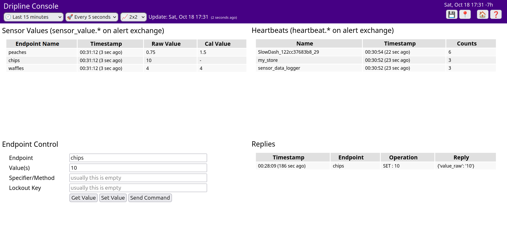

Dripline Console
================


## Setup
Copy the `slowdash.d/config/slowtask-DriplineConsole.py` file to your SlowDash configuration directory.
Enable the slowatsk in your `SlowdashProject.yaml`:
```yaml
  task:
    name: DriplineConsole
    auto_load: true
```
