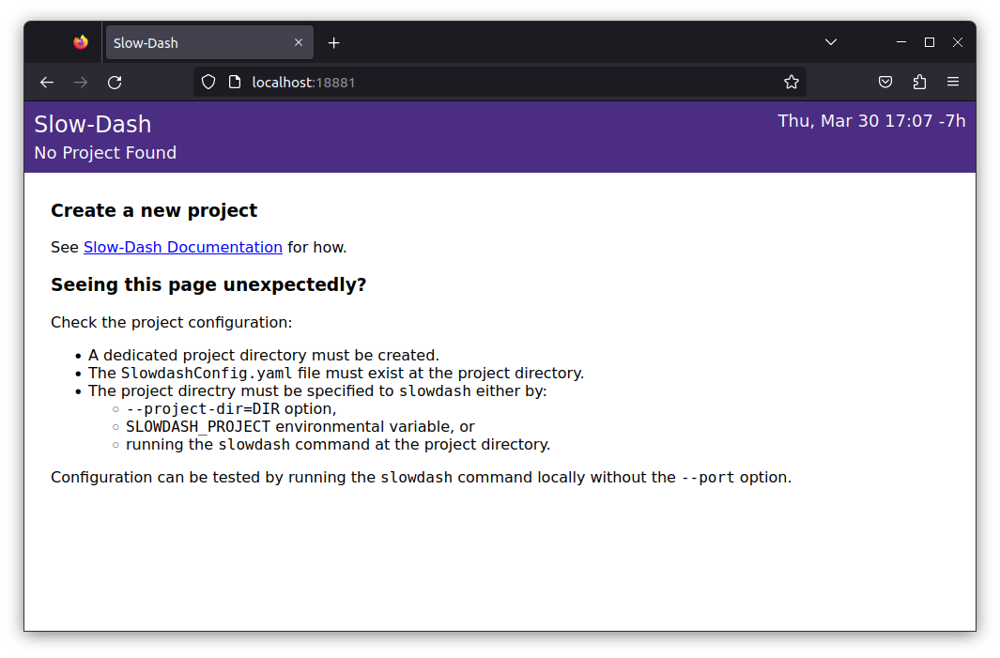

# Docker
## Prerequisite
- `git`
- `docker` and `docker-compose`

## Using Docker Images (amd64-linux)
- DockerHub: [slowproj/slowdash:TAG](https://hub.docker.com/r/slowproj/slowdash/tags)
- GitHub Container Registry: [ghcr.io/slowproj/slowdash:TAG](https://github.com/slowproj/slowdash/pkgs/container/slowdash)

Choose a specific tag. The `:latest` tag is not made on purpose.

## Building an Image
```console
$ git clone https://github.com/slowproj/slowdash.git --recurse-submodules
$ cd slowdash
$ docker build -t slowdash .
```

# Standard (Bare-Metal) Installation
## Prerequisite
### Base System
- UNIX-like OS
  - Linux most tested
  - macOS and Windows (WSL) seem ok
<p>
- Python 3
  - Version >= 3.7
  - with NumPy and pyyaml
<p>
- Web Browser
  - Firefox most tested, Chrome &amp; Edge ok, Safari &amp; Opera never tested.
  - Also works on mobile devices 

### Data Backend
Install standard Python modules for the data storage system being used.

Currently supported data backend systems are:

|DBMS              |Python Module|
|------------------|-------------|
| PostgreSQL       | psycopg2    |
| MySQL            | mysqlclient |
| SQLite           | (none)      |
| Other SQL DBs (generic) | sqlalchemy  |
| InfluxDB         | influxdb-client  |
| Redis            | redis  |
| CouchDB            | couchdb  |
| MongoDB            | pymongo  |
| System Resource (*) | psutil      |
*) "System Resource" is a pseudo-database, responding to queries for CPU, memory and disk usage etc.

See [Data Binding section](DataBinding.html) for details.


## Installing
This process will not create any files other than the git-cloned directory. Installation can be removed completely by deleting this directory.
```console
$ git clone https://github.com/slowproj/slowdash.git --recurse-submodules
$ cd slowdash
$ make
```

This will create a bash file to set environmental variables. `source` it to include the settings:
```console
$ source PATH/TO/SLOWDASH/bin/slowdash-bashrc
```
For permanent installation, it might be convenient to include this line in the `.bashrc` file.

Test the installation by running the command:
```console
$ slowdash
Usage: 
  Web-Server Mode:    slowdash.py [Options] --port=PORT
  Command-line Mode:  slowdash.py [Options] Command

Options:
  -h, --help            show this help message and exit
  -p PORT, --port=PORT  port number for web connection; command-line mode
                        without this option
  --project-dir=PROJECT_DIR
                        project directory (default: current dir if not
                        specified by SLOWDASH_PROJECT environmental variable)
```

Test the browser connection using an arbitrary port. As we have not yet defined a project, a warning message will be shown, but we proceed for now.
```console
$ slowdash --port=18881
23-05-15 20:12:35 WARNING: unable to find Slowdash Project Dir: specify it with the --project-dir option, set the SLOWDASH_PROJECT environmental variable, or run the slowdash commands at a project directory
listening at port 18881
```
```console
$ firefox http://localhost:18881
```
On success, the error messages below will be shown:



Type `Ctrl-c` to stop slowdash.


## Updating
If slowdash is already running, stop it before updating it.
```console
$ cd PATH/TO/SLOWDASH
$ git pull --recurse-submodules
$ make
```
Often `make` does not do anything, but it is safe to run it every time.
