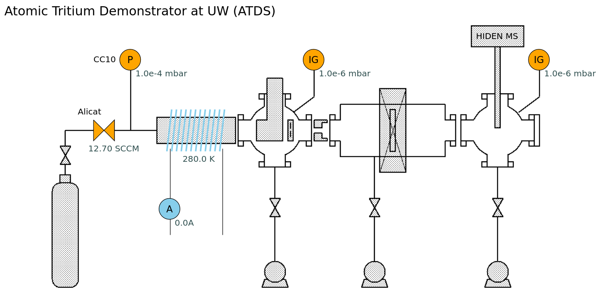
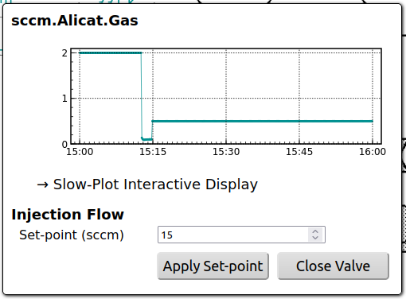
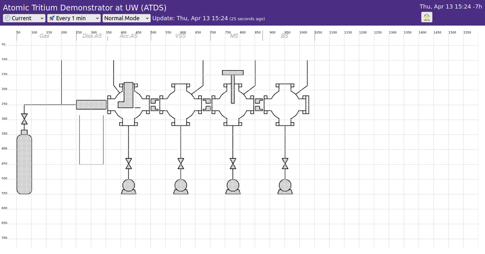
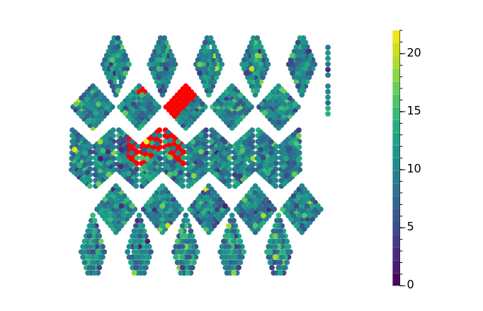
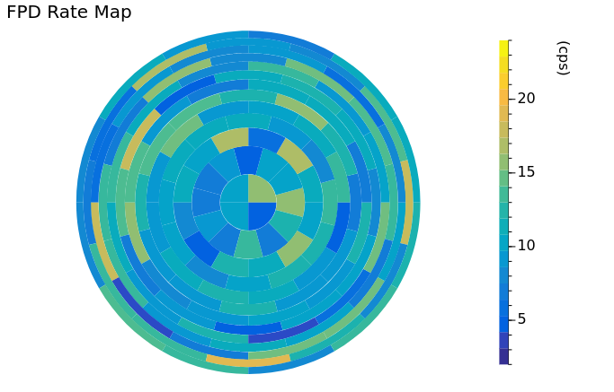

# Time-Axis Plot (Time-Series)

# XY Plot (Histograms & Graphs)

# Canvas


- Canvas = Base_Image + Items (although base image is an item).
- Items are graphical element on the base image.
- Most items are bound to data values (metric).
- Most items (can) show data values by text next to it.
- "Shape Items" (can) show active/non-active status based on data values.

## User Canvas Configuration File
- User configuration file describes the base image and elements.
- The file is located under `PROJECT/config`, and the name must be `slowdash-NAME.json`.
- Example from `Projects/ATDS/Config`:
```json
{
    "meta": {
        "name": "ATDS",
        "title": "",
        "description": "Atomic Tritium Demonstrator at UW Top Level"
    },

    "view_box": "0 -10 1600 700",
    
    "items": [
        {
            "type": "image",
            "attr": { "x": 50, "y": -2, "height": 554, "width": 1003, "href": "ATDS.png" }
        },
        {"_type": "grid"},
        
        {
            "type": "valve", 
            "attr": {
                "x": 135, "y": 235, "width": 30, "height": 30, "orientation": "horizontal",
                "data-dx": -10, "data-dy": 50
            },
            "metric": { "channel": "sccm.Alicat.Gas", "active-above": 0.1, "format": "%.1f sccm" },
            "action": { "form": "AlicatFlow" }
        },
        {
            "type": "circle",
            "attr": { "x": 185, "y": 85, "width": 30, "height": 30, "label": "P" },
            "metric": { "channel": "mbar.CC10.Gas", "active-below": 1, "format": "%.1e mbar" }
        },

        ...
    ],
    
    "forms": {
        "AlicatFlow": {
        ...
    }
}
```
- `meta` for meta information of this configuration file.
- `view_box` defines the coordinate for item placement.
- `items` is a list of items.
- `forms` is for a mini control panel to send commands to server-side scripts (typically to control the device).

### Item Attributes
- Attributes describes how the items appear on the canvas.
- Attributes are mostly identical to SVG attributes for the corresponding shape, with some additions.
- Commonly used SVG attributes are:
  - `x`, `y`, `width`, `height`: position and size of the item on the canvas
  - `stroke`, `fill`: line color and fill color
- Some additional attributes are:
  - `label`: text drawn in the shape
  - `label-dx`, `label-dy`: offset position of the label text
  - `label-font-family`, `label-font-size`: label font
  - `data-dx`, `data-dy`: offset position of the data value indicator
  - `data-font-family`, `data-font-size`: data indicator font
  - `data-color`: data indicator color

### Metric Mapping
- Items can have associated metrics. 
- With an associated metric, items will:
  - change the fill color according to the data values
  - display a "data label" showing the latest value of the metric
  - show a warning icon for alarm status
  - open a dialog containing a history plot and controls

##### Example:
```json
{
    "metric": { "channel": "mbar.CC10.Gas", "active-below": 1, "format": "%.1e mbar" },
    ...
}
```

- `active-above` and/or `active-below` defines the active range. The color of the item changes accordingly.
- `format` is used for data indicator text.
- `tolerable-gap` can be specified for gap in time-series before alarm icon is shown. Default is 60 sec.

### Action Binding
- Items can have associated actions. 
- Actions can be:
  - sending commands to a server-side user scripts (see [UserModule](UserModule.html))
  - opening a web page
 
##### Example: Opening a web page
```json
{
    "action": { "open": "./slowplot.html?config=slowplot-ATDS.json" },
    ...
}
```
##### Example: Sending a command to server-side User Module
```json
{
    "action": { "submit": { "action": "restart_IG" } },
    ...
}
```
##### Example: Sending a command to server-side User Module with parameters ("form")
```json
{
    "action": { "form": "AlicatFlow" },
    ...
}
```
Forms are defined separately in the same configuration file:
```json
{
    "forms": {
        "AlicatFlow": {
            "title": " Injection Flow",
            "initial": {},
            "inputs": [
                { "name": "flow", "label": "Set-point (sccm)", "type": "number", "step": 0.1 "initial": 15 }
            ],
            "buttons": [
                { "name": "apply", "label": "Apply Set-point" },
                { "name": "close", "label": "Close Valve" }
            ]
        },
        ...
    },
    ...
}
```
The configuration above creates a form like this (bottom part of the panel):



## Items
### Base Image
- type: `image`
- attributes (defaults):
```json
{
    "href": null,
    "x": null, "y": null, "height": null, "width": null
}
```

##### Tips
  - For `width` and `height`, using the same aspect ratio as the image file will prevent stretching.
  - Use the Grid item below to see the coordinates for item placement.
  - Adjust `x` and `y` (and possibly `width` and `height`) to place the base image for a convenient alignment.

### Grid
- type: `grid`
- draws coordinate grids. Useful when placing elements on base image.
<p>
- Tips: change `type: grid` to `_type: grid` to disable the grid once item placement is completed.

##### Example: minimal Base Image and Grid
```JSON
{
    "view_box": "0 -10 1600 700",
    "items": [
        {
            "type": "image",
            "attr": { "x": 50, "y": -2, "width": 1003, "height": 553, "href": "ATDS.png" }
        },
        {"type": "grid"},
    ]
}
```


- Here the image file size is 1003x553. The `width` and `height` attributes are set to match the image dimension. Changing these values scales the image.
- The `x` and `y` attributes are adjusted to align the image component nicely on the grid.
- The global `view_box` defines the overall coordinate, in (xmin, ymin, xmax, ymax). Non-zero min values are often useful to adjust the margin.

### Shape Items
- Boxes, circles, etc., can be placed on the canvas, typically on a base image.
- Shape items without `metric` binding create static shapes.
- Shape items with `metric` binding will have:
  - dynamic `fill` colors based on data values.
  - "data labels" showing the value, with format indicated in `"metric": {"format": ...}`
  
Attributes common among Shape Items and the default values are:
```json
{
    "x": null, "y": null, "height": null, "width": null,
    "label": null,
    "stroke": this.style.strokeColor,
    "fill": "none",
    "data-dx": null, "data-dy": null,
    "label-dx": null, "label-dy": null,
    "data-color": this.style.dataColor,
    "data-font-family": this.style.dataFontFamily,
    "data-font-weight": this.style.dataFontWeight,
    "data-font-size": this.style.dataFontSize,
    "data-dominant-baseline": undefined,
    "data-text-anchor": undefined,
    "label-font-family": this.style.labelFontFamily,
    "label-font-weight": this.style.labelFontWeight,
    "label-font-size": this.style.labelFontSize,
    "label-dominant-baseline": "central",
    "label-text-anchor": "middle",
}
```
#### Box Shape
- type: `box`

mandatory attributes and default values are:
```json
{ "x": null, "y": null, "width": 30, "height": 30 }
```
#### Circle Shape
- type: `circle`
  
Mandatory attributes and default values are:
```json
{ "x": null, "y": null, "width": 30, "height": 30 }
```

#### Valve Shape
- type: `valve`

Mandatory attributes and default values are:
```json
{ "x": null, "y": null, "width": 30, "height": 30, "orientation": "horizontal" }
```

#### Solenoid Shape
- type: `solenoid`

Mandatory attributes and default values are:
```json
{ "x": null, "y": null, "width": 50, "height": 30, "fill": "none", "stroke-width": 3, "turns": 12 }
```

#### Invisible Shape
- type: `invisible`
<p>
- no shape will be drawn; only data values
- The `x` and `y` attributes are still necessary to draw the data labels.

Mandatory attributes and default values are:
```json
{ "x": null, "y": null }
```    

### Text
- type: `text`
<p>
- Text with static attributes only creates a static text label.
- Text with `"action": {"open": URL}` creates a hyperlink.
- Text with `metric` shows only the data values. (the `text` attribute will have no effect.)

Mandatory attributes and default values are:
```json
{
    "x": null, "y": null, "text": "",
    "font-family": this.style.fontFamily,
    "font-weight": this.style.fontWeight,
    "font-size": this.style.fontSize,
    "fill": this.style.strokeColor,
    "data-color": this.style.dataColor
}
```

### Button
- Type: `plot`
<p>
- Typically used with `action`.

Mandatory attributes and default values are:
```json
{
    "x": null, "y": null, "width": 120, "height": 30,
    "rx": 5, "ry": 5,
    "label": "",
}        
```

### Embedded Plot
- Type: `plot` / `micro_plot`
<p>
- Use `metric` to assign a channel.

Mandatory attributes and default values for a `plot` are:
```json
{
    "x": 0, "y": 0, "width": 100, "height": 100, "zoom": 0.8,
    "length": 3600, "dateFormat": null, "label": null,
    "ticksX": 5, "ticksY": 2, "grid": true,
    "min": null, "max": null, "logY": false,
    "marginTop": 0,
    "data-color": this.style.dataColor,
    "fill-opacity": 0, "fill-baseline": 1e-100,
    "timerange-margin-percent": 3,
}
```

`micro_plot` is a small box showing a data history plot without axis labels. This is basically the same as `plot`, with some different default values:
```json
{
     "width": 50, "height": 30, "zoom": 0.2,
     "marker-opacity": 0, "fill-opacity": 0.3,
     "ticksX": 0, "ticksY": 0, 
     "marginTop": 0, "marginBotton": 0, "marginLeft": 0, "marginRight": 0,
     "label": ""
    "timerange-margin-percent": 0,
}
```


# Map
- Map is a schematic representation of a graph of `(x,y)`.
- The graph value of `x` is used for index of elements, and `y` is used for color.
- Element shapes are described in a user configuration file.




## User Map File
### File Format
- JSON file, containing a list of shape elements. Shapes are SVG drawable elements.
- The `index` fields define binding to the `x` values of the data object (graph or histogram).

Example 1:
```json
{
  "width": 1.0,
  "height": 1.0,
  "items": [
    {"index":1200,"shape":"circle","attr":{"cx":0.370000,"cy":0.822000,"r":0.015}},
    {"index":1201,"shape":"circle","attr":{"cx":0.403000,"cy":0.814000,"r":0.015}},
    {"index":1202,"shape":"circle","attr":{"cx":0.367000,"cy":0.780000,"r":0.015}},
    {"index":1203,"shape":"circle","attr":{"cx":0.400000,"cy":0.783000,"r":0.015}},
    ...
  ]
}
```

Example 2:
```json
{
    "width": 1.000, 
    "height": 1.000,
    "items": [
        {
            "index": 0, 
            "shape": "path", 
            "attr": {
                "d": "M0.500,0.500 L0.580,0.500 A0.080,0.080 0 0,0 0.500,0.420 z"
            }
        }, 
        {
            "index": 1, 
            "shape": "path", 
            "attr": {
                "d": "M0.500,0.500 L0.500,0.420 A0.080,0.080 0 0,0 0.420,0.500 z"
            }
        }, 
    ...
  ]
}
```

### Creator Tool
- For simple cases where shapes are only circles, `utils/xy2map.py` can be used to create a JSON map file from a CSV of `index, x, y`.
```csv
index,x,y
24,0.485,0.915
25,0.461,0.915
26,0.449,0.915
...
```

```console
$ PATH/TO/SLOWDASH/xy2map.py NAME.csv > map-NAME.json
```
- [TODO] This utility will be further improved. Currently hard-coded values are:
  - `width` and `height` are both 1.0.
  - `radius` is 0.01.
- [TODO] with the `--svg` option a SVG image file will be also created, which is convenient to test the map file.
  

# HTML / Form
- Displays a HTML page described in an user HTML file stored under the user configuration directory.
- The user configuration file can contain a `<form>` to send commands to the server-side user script.
- When the form is submitted, a function in the user script (dispatcher) is called with the form data as a JSON object (see the [User Module section](UserModule.html)).
<p>
- [TODO] If the `Current` property is set, the panel contents are displayed only when the display time range includes "now".

##### Implementation
- `div.innerHTML = ...` with parameter substitutions.

##### Restrictions
- User HTML cannot contain JavaScript. To use the full feature of HTML and JavaScript, consider using the External Page panel.

## User HTML File
##### Example:
```html
<h3>Crate Power Control</h3>
Temperature: <span sd-value="ch1->last()->format('%.1f degC')">---</span>
<p>  
<form>
  <input type="hidden" name="form" value="power_control">
  <div style="margin:10px;border:thin solid;padding:10px;width:30em">
    <label><input type="checkbox" name="crate1">Crate 1</label><br>
    <label><input type="checkbox" name="crate2">Crate 2</label><br>
    <label><input type="checkbox" name="crate3">Crate 3</label><br>
  </div>
  <p>
  <select name="action">
    <option value="turn_on">Turn On</option>
    <option value="turn_off">Turn Off</option>
  </select>
  <p>
  <input type="submit" value="Apply" style="font-size:x-large">
</form>
```

- Either full or partial HTML can be used. CSS in `<head>` works.
- Use `<form>` to submit command to the server-side user code.

#### Data Binding
- `<span>` and `<div>` can have a binding to data: use the `sd-value=METRIC` attribute.
  - Example: `<span sd-value="pressure->format('%.3e mbar')">--</span>`
<p>
- `<input>` also can have a binding to data, but the values are updated at the initial loading and after every user operation.
  - Example: `<input type="number" name="threshold" sd-value="threshold">`
<p>
- `<input>` can be enabled/disabled based on data values: use the `sd-enabled=METRIC` attribute.
  - Here the value of the METRIC must be a boolean.
  - Example: `<input type="submit" name="start" value="Start" sd-enabled="RnuInfo['Status']->match('Idle')">`
<p>
- For the expressions that can be used in `sd-value` and `sd-enabled`, see the [Data Transform section](DataTransform.html).

#### Action/Variable Binding


# Table

# Tree

# Blob
- Primarily intended for image data, but can be used for many others.
- Data must have a MIME type and URL.

##### Implementation
- For mime type of `image/*`, ``
- For others, `<iframe src="...">`


# External Page
- Maybe useful for Web-Cam etc.
- [TODO] If the `Current` property is set, the page is displayed only when the display time range includes "now".
- [TODO] Parameter substitution in URL
  
##### Implementation
- `<iframe src="...">`

##### Restrictions
- For external sites, some operations are prohibited due to the same-origin security policy, including:
  - auto scaling (auto fit to panel size etc.)
  - display offset
  - mouse click detection (for Autocruise etc.)

## External User Page with SlowDash data and controls
[ WRITE THIS ]
