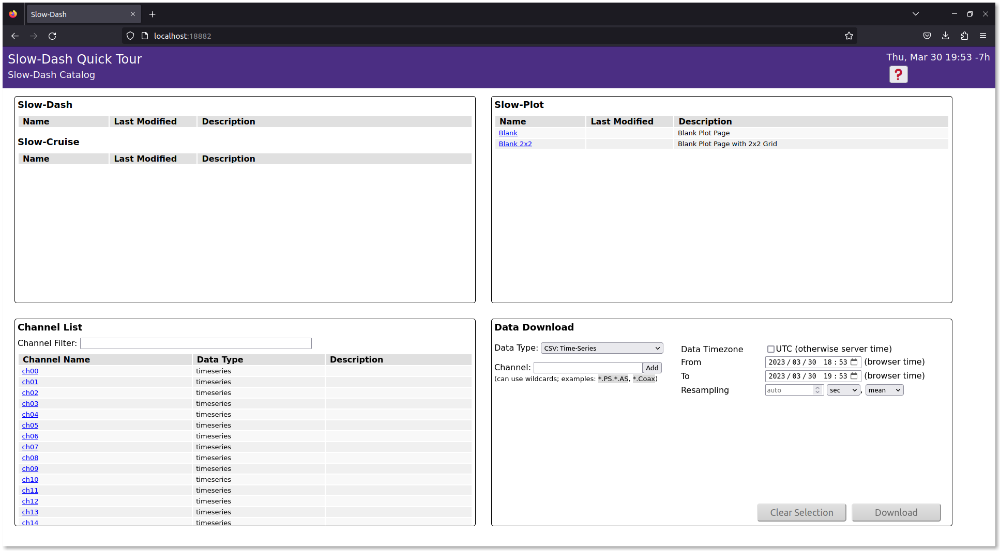
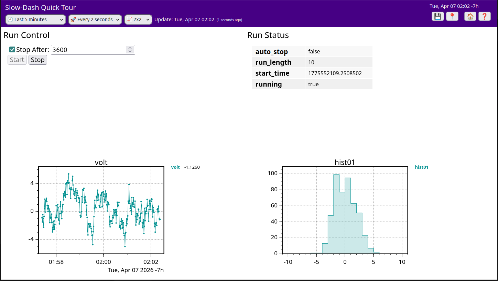

# Course Overview
This tour demonstrates how to use SlowDash with SQLite as the data backend, which requires no server setup. All files created during this tour are contained within a single project directory and can be completely removed by simply deleting that directory.

### Menu
- Configure a project by defining the user data schema
- Run SlowDash with test data
- Create interactive plots through the web interface
- Write scripts to read data from devices
- Send commands from the web interface to user scripts

### Getting Started
First, create and navigate to a new project directory:
```console
$ mkdir QuickTour
$ cd QuickTour
```

### Docker Users
If you're using Docker, the directory you just created will be mounted as a volume in the container. You can work either inside the container (using `docker exec ... /bin/bash`) or outside. In the beginning, we recommend working outside the container.

# Test Data Generation
We'll use the SlowPy Python library, included with the SlowDash package, to generate test data. Create a file named `generate-testdata.py` in your project directory with the following code:
```python
from slowpy.control import ControlSystem, RandomWalkDevice
from slowpy.store import DataStore_SQLite, LongTableFormat

class TestDataFormat(LongTableFormat):
    schema_numeric = '(datetime DATETIME, timestamp INTEGER, channel VARCHAR(100), value REAL, PRIMARY KEY(timestamp, channel))'
    def insert_numeric_data(self, cur, timestamp, channel, value):
        cur.execute(f'INSERT INTO {self.table} VALUES(CURRENT_TIMESTAMP,%d,?,%f)' % (timestamp, value), (channel,))

ctrl = ControlSystem()
device = RandomWalkDevice(n=4)
datastore = DataStore_SQLite('sqlite:///QuickTourTestData.db', table="testdata", table_format=TestDataFormat())

def _loop():
    for ch in range(4):
        data = device.read(ch)
        datastore.append(data, tag="ch%02d"%ch)
    ctrl.sleep(1)
    
def _finalize():
    datastore.close()
    
if __name__ == '__main__':
    ctrl.stop_by_signal()
    while not ctrl.is_stop_requested():
        _loop()
    _finalize()
```

Details of the script are described in the [Controls](ControlsScript.html) section. For now, just copy and paste the script and use it to generate some test data.

If you installed SlowPy in a virtual environment (the standard installation method), activate it using either:
```console
$ slowdash-activate-venv
```
or (if `slowdash-bashrc` hasn't been sourced):
```console
$ source PATH/TO/SLOWDASH/venv/bin/activate
```

Running this script will create a SQLite database file and populate it with simulated time-series data every second:
```console
$ python3 generate-testdata.py
```

After letting it run for about a minute, stop the script using `Ctrl`-`c` and examine the created files:
```console
$ ls -l
-rw-r--r-- 1 sanshiro sanshiro 24576 Apr 11 16:52 QuickTourTestData.db
-rwxr-xr-x 1 sanshiro sanshiro  3562 Apr 11 16:51 generate-testdata.py
```

You can inspect the database contents using the SQLite command-line program, `sqlite3`. If this program isn't available on your system, you can skip this step and view the data through SlowDash in the next section.
```console
$ sqlite3 QuickTourTestData.db 
SQLite version 3.31.1 2020-01-27 19:55:54
Enter ".help" for usage hints.
sqlite> .table
testdata
sqlite> .schema testdata
CREATE TABLE testdata(datetime DATETIME, timestamp INTEGER, channel VARCHAR(100), value REAL, PRIMARY KEY(timestamp, channel));
sqlite> select * from testdata limit 10;
2023-04-11 23:52:13|1681257133|ch00|0.187859
2023-04-11 23:52:13|1681257133|ch01|-0.418021
2023-04-11 23:52:13|1681257133|ch02|0.482607
2023-04-11 23:52:13|1681257133|ch03|1.733749
...
```

As shown above, the schema of the data table is:
```
testdata(datetime DATETIME, timestamp INTEGER, channel VARCHAR(100), value REAL, PRIMARY KEY(timestamp, channel))
```

and the table contents are:

|datetime (DATETIME/TEXT)|timestamp (INTEGER)|channel (VARCHAR(100))|value (REAL)|
|----|-----|-----|-----|
|2023-04-11 23:52:13|1681257133|ch00|0.187859|
|2023-04-11 23:52:13|1681257133|ch01|-0.418021|
|2023-04-11 23:52:13|1681257133|ch02|0.482607|
|2023-04-11 23:52:13|1681257133|ch03|1.733749|
|...||||

(Note: In SQLite, DATETIME is stored as TEXT. Times are in UTC, though not explicitly specified.)

For demonstration purposes, this table includes two timestamp columns: one for (emulated) hardware data time in UNIX timestamp format, and another for database writing time in datetime format. In a real system, you might use just one of these formats.

For information about other supported data table formats, please refer to the [Data Binding section](DataBinding.html).

# Basic Usage

## Project Configuration
Each SlowDash project requires a configuration file named `SlowdashProject.yaml` in the project directory. This file specifies which database to read, which columns contain timestamps and data values, and other essential settings.

### Creating the Configuration File

Create `SlowdashProject.yaml` with the following content:
```yaml
slowdash_project:
  name: QuickTour
  title: SlowDash Quick Tour

  data_source:
    url: sqlite:///QuickTourTestData.db
    time_series:
      schema: testdata [channel] @timestamp(unix) = value
```

To use the `datetime` column for timestamps instead, modify the schema section as follows:
```yaml
      time_series:
          schema: testdata[channel]@datetime(unspecified utc)=value
```
The timestamp type is specified after the time column name. Common timestamp types include:
- `aware` (or `with time zone`): for time data with explicit time zones
- `naive` (or `without time zone` or `local`): for implied "local" time zone (generally not recommended)
- `unspecified utc`: for time data without explicit time zones but known to be in UTC

### Verifying the Configuration

(Docker users should first enter the container using `docker exec -it CONTAINER_ID /bin/bash`.)

Test your configuration using the `slowdash config` command in the project directory:
```console
$ slowdash config
{
    "project": {
        "name": "QuickTour",
        "title": "SlowDash Quick Tour",
        "error_message": ""
    },
    "data_source": {
        "type": "SQLite",
        "parameters": {
            "file": "QuickTourTestData.db",
            "time_series": {
                "schema": "testdata[channel]@timestamp(unix)=value"
            }
        }
    },
    "style": null,
    "contents": {
        "slowdash": [],
        "slowplot": []
    }
}
```

The channels in the data-store can be listed with the `slowdash channels` command:
```console
$ slowdash channels
[
  {"name": "ch00"}, {"name": "ch01"}, {"name": "ch02"}, ...
]
```

The data values can be displayed with the `slowdash data` command:
```console
$ slowdash "data/ch00?length=10"
{
  "ch00": {
    "start": 1680223465, "length": 10, 
    "t": [0.0, 2.0, 3.0, 4.0, 5.0, 6.0, 7.0, 8.0, 9.0], 
    "x": [5.180761, 5.92074, 5.515459, 4.883299, 5.650556, 4.284527, 3.884656, 3.223627, 2.06343]
  }
}
```

## Running the Application
### Step 1: Launch the SlowDash Server
This step starts a SlowDash server on port 18881. To stop the server, press `Ctrl`-`c`.

#### Native (directly on the host, without containers)
```console
$ slowdash --port=18881
```

#### Docker
Image from DockerHub
```console
$ docker run --rm -p 18881:18881 -v $(pwd):/project slowproj/slowdash
```
or locally created image:
```console
$ docker run --rm -p 18881:18881 -v $(pwd):/project slowdash
```

#### Docker-Compose
Create a `docker-compose.yaml` file in the project directory
```yaml
version: '3'

services:
  slowdash:
    image: slowproj/slowdash
    volumes:
      - .:/project
    ports:
      - "18881:18881"
```

Then start `docker compose`
```console
$ docker compose up
```


### Step 2: Opening a Web Browser
Launch a web browser and access `http://localhost:18881`.
```console
$ firefox http://localhost:18881
```
The browser should show the home page of the project:




### Step 3: Start Generating Testdata (only for this quick tour)
In order to continuously fill the data while plotting, run the test-data generator in parallel (maybe in another terminal window):
```console
$ python3 generate-testdata.py
```
The data file size is roughly 5 MB per hour. The test data file, `QuickTourTestData.db`, can be deleted safely when SlowDash is not running.
Once the file is deleted, run `generate-testdata.py` again before starting SlowDash next time.


## Creating Plots
### Interactive Plot Building
The easiest way to get started is to explore the GUI:

- Click any channel in the "Channel List" panel to create a time-series plot
- Or click "New Plot Layout" in the "Tools" panel to start with an empty layout
- Hover over empty space to reveal the "Add New Panel" button
- Click it and select "Time-Axis Plot" to create a new plot
- Hover over any plot to access control buttons
- Click the &#x1f6e0; (wrench) icon to configure axes, styles, and add new time series

Currently, only time-series plots are available since our test database contains only time-series data.

### Saving Your Work
You can save and share your plot layouts (called SlowPlot Layouts) by clicking the &#x1f4be; (save) button in the top-right corner.
Saved layouts appear on the SlowDash home page.

### Creating Panels via URL
#### Using Configuration Files
Open a saved layout with a specific time range using a URL:
```
http://localhost:18881/slowplot.html?config=slowplot-QuickTour.json&time=2023-03-30T18:00:00&reload=0
```

#### Using Channel Specifications
Create a new layout directly through a URL by specifying channels and plot types:
```
http://localhost:18881/slowplot.html?channel=ch00;ch00/ts-histogram&length=360&reload=60&grid=2x1
```


# Reading Data from Hardware Devices
SlowDash consists of two parts, a web application (web server + browser UI) and a Python library used in user scripts.
In the previous example with test data, we used this library, called SlowPy.
The application and library work seamlessly together, but each can also operate independently.
In this section, we'll use the SlowPy library alone to read real data from a device, replacing the dummy data generator used in the previous section.

## Preparation
SlowPy is installed automatically along with SlowDash. In the standard installation, it resides inside a virtual environment (venv). Please activate this venv before starting:
```console
$ slowdash-activate-venv
```

You need to run this command every time you open a new terminal. If you're using a dedicated SlowDash machine and no other Python environments, you can add the following line to your `.bashrc` to avoid doing it manually:
```bash
source $SLOWDASH_DIR/venv/bin/activate
```

## Target Devices
Here, we'll show an example that reads DC voltage from a network-controllable digital multimeter (DMM).
Many DMMs share common command sets, and we have confirmed the following models (verified by ChatGPT, August 2025):

| Manufacturer | Model |
|---------------|--------|
| Keysight / Agilent | 34460A DMM |
| Tektronix / Keithley | DMM6500 |
| Rigol | DM3058 |
| BK Precision | 5492B DMM |

Similarly, many DC power supplies use the same command for output voltage readout. You can therefore use the same example code. The following models are confirmed (ChatGPT, August 2025):

| Manufacturer | Model |
|---------------|--------|
| Keysight / Agilent | E363x / E364x |
| Tektronix / Keithley | 2230G / 2231A |
| Rohde & Schwarz | NGA100 series |
| Rigol | DP800 / DP2000 |
| BK Precision | 9180 / 9190 |

All of these devices are controllable via Ethernet.
Before proceeding, make sure your device is powered on, connected to the network, and that you know its IP address (and port number, to be sure - see the manual).

### If No Device Is Available
According to ChatGPT, most DMMs and power supplies share a compatible command set.
If you have any network-controllable device that can report voltage, you might be able to use it here.

If you don’t have access to any physical device, SlowDash provides a built-in simulator.
You can launch it as follows:

```console
$ slowdash-activate-venv
$ cd PATH/TO/SLOWDASH/utils
$ python ./dummy-scpi.py
listening at 172.26.0.1:5025
line terminator is: x0d
type Ctrl-c to stop
```

This behaves like a real device on your local network (running on `localhost`). Press `Ctrl-C` to stop it.


## Reading Data from the Device
All of the above devices use the SCPI (Standard Commands for Programmable Instruments) text-based protocol.
The commands we'll use here are as follows:

| Action | Command | Example Response |
|---------|----------|----------------|
| Get device ID | `*IDN?` | `Keysight Technologies,34460A...` |
| Reset settings | `*RST` | (no response) |
| Read DC voltage | `MEAS:VOLT:DC?` | `3.24` |

In SlowPy, device control is represented as a logical control tree, where each node of the tree has `set(value)` and/or `get()`. For this SCPI example, the hierarchy looks like:
```
[Measurement System] → [Ethernet] → [SCPI Control] → [Command Nodes]
```

A complete SlowPy script to retrieve and print the device ID is:
```python
from slowpy.control import control_system as ctrl
print(ctrl.ethernet('172.26.0.1', 5025).scpi().command('*IDN?').get())
```
Adjust the IP address and port number as needed. With this two line code, you can verify the connection:
```console
$ slowdash-activate-venv
$ python read-my.py
Keysight Technologies,34460A...
```

Multiple calls to the connection node (`.ethernet()`) may or may not create a new connection every time, depending on the node specification and optional parameters.
A common practice is to keep the device-level node in a variable.

Example: continuously read DC voltage once per second after resetting the device.
```python
from slowpy.control import control_system as ctrl
device = ctrl.ethernet('172.26.0.1', 5025).scpi()

device.command('*RST').set()

while True:
    volt = device.command('MEAS:VOLT:DC?').get()
    print(volt)
    ctrl.sleep(1)
```
(`ctrl.sleep()` behaves like `time.sleep()`, but works better with SlowDash’s signal handling.)

## Storing Data in a Database
SlowPy also provides database-write capabilities.
The following code stores the measurements into a local SQLite database instead of printing them.
```python
from slowpy.control import control_system as ctrl
device = ctrl.ethernet('172.26.0.1', 5025).scpi()

from slowpy.store import DataStore_SQLite
datastore = DataStore_SQLite('sqlite:///TestData.db', table="slowdata")

device.command('*RST').set()

while True:
    volt = device.command('MEAS:VOLT:DC?').get()
    datastore.append({'volt': volt})
    ctrl.sleep(1)
```
Running this script instead of the dummy-data generator enables SlowDash to visualize real measurements.
Stop it with `Ctrl-C` or `Ctrl-\`. (You might see messy output, but it’s harmless.)


## Integrating the Script into the SlowDash Application
Any Python script (not necessarily using SlowPy) placed in your project's `config` directory as `slowtask-XXX.py` will automatically appear in the "SlowTask" section of the SlowDash home screen, where it can be controlled via the web interface.

You can also configure it to auto-start or edit directly from the browser via entries in `SlowdashProject.yaml` (see the official documentation).

However, the previous script cannot be gracefully stopped yet. To allow start/stop control from the app, implement the callback functions defined by SlowDash, such as `_loop()` and `_run()`:

```python
from slowpy.control import control_system as ctrl
device = ctrl.ethernet('172.26.0.1', 5025).scpi()

from slowpy.store import DataStore_SQLite
datastore = DataStore_SQLite('sqlite:///QuickTourTestData.db', table="testdata")

device.command('*RST').set()

def _loop():
    volt = device.command('MEAS:VOLT:DC?').get()
    datastore.append({'volt': volt})
    ctrl.sleep(1)
```

Here, `while True` is replaced by `def _loop()`.
When executed by SlowDash, `_loop()` will be repeatedly called in a managed thread.

See the "Control Script" section of the documentation for additional callbacks such as `_initialize()` and details about threads and asynchronous execution.

To make the script runnable standalone, add:
```python
if __name__ == '__main__':
    while True:
        _loop()
```

Or, for graceful termination with `Ctrl-C`:
```python
if __name__ == '__main__':
    ctrl.stop_by_signal()
    while not ctrl.is_stop_requested():
        _loop()
```

A full working example is provided in `ExampleProjects/QuickTour/02_RealDevice`.
```console
$ cd PATH/TO/SLOWDASH/ExampleProjects/QuickTour/02_RealDevice
$ slowdash --port=18881
```

Open your browser at <http://localhost:18881> — you'll find "read-my" under SlowTask, with [start] and [stop] buttons.

You can still run the script without the SlowDash app as before:
```console
$ slowdash-activate-venv
$ python config/slowtask-read-my.py
```

## Additional Notes
For power supply devices that need voltage control:
```python
from slowpy.control import control_system as ctrl
device = ctrl.ethernet('172.26.0.1', 5025).scpi(append_opc=True)

device.command('VOLT').set(3.0)    # sends "VOLT 3.0; *OPC?"
device.command('OUTP').set('ON')   # sends "OUTP ON; *OPC?"
```

SlowPy expects every command to return a response.
If the device doesn't normally return one, append `*OPC?` to make it respond when complete.
You can apply this globally (as above) or per-command by:
```python
device.command('OUTP ON; *OPC?').set()
```

For USB or RS-232 devices, replace the Ethernet part of the control tree.
For example, using a VISA interface:
```python
from slowpy.control import control_system as ctrl
ctrl.load_control_module('VISA')    # Load VISA plugin
device = ctrl.visa('USB00::0x2A8D::0x201:MY54700218::00::INSTR').scpi()

# (rest is the same)
```

For Ethernet devices using HiSLIP, also use VISA with an address like: `TCPIP0::<IP address>::hislip0`.

## Bonus: Turning a Raspberry Pi into an SCPI Device
The SlowPy library also includes a server-side SCPI interface, allowing any Python program to act as an SCPI-controllable device, making it fully compatible with SlowDash monitoring, control, and data storage.

```python
from slowpy.control import ScpiServer, ScpiAdapter

class MyDevice(ScpiAdapter):
    def __init__(self):
        super().__init__(idn='MyDevice')

    def do_command(self, cmd_path, params):
        # cmd_path: list of strings, uppercase SCPI path parts (split by :)
        # params:   list of strings, uppercase SCPI parameters (split by ,)
        if cmd_path[0].startswith('DATA'):
            return <data_value>
        elif ...:
            ...
        return None  # Unknown command

device = MyDevice()
server = ScpiServer(device, port=5025)
server.start()
```

In `do_command()`, simply read the command and return a string value.
Return an empty string `""` for commands with no response, or `None` for invalid commands.
Standard commands like `*IDN?` and `*OPC?` are already implemented in the base class, and command concatenation (`;`) is automatically handled.

If you add this script to `/etc/rc.local` or a similar startup mechanism, your Raspberry Pi can act as a real SCPI device accessible over the network.
This is convenient not only for using the attached hardware through GPIB/I2C/SPI, but also for integrating USB devices (even with a vendor-provided library) as Ethernet-SCPI devices.


# Control from the Web GUI
In the two examples above, we first used SlowDash as a data browser and then used the SlowPy library to retrieve data, but they were separate pieces. Here, we will integrate them so that you can control a device from the browser, acquire data, and send it back to the browser either through the database or by direct streaming for display.

We will proceed in the following four steps:

1. Create an input form with buttons in the browser and call Python script functions on button clicks
2. Add input elements in the browser and pass their values as function call arguments
3. Send data directly from Python code to the browser and change control panel display based on the current state
4. Build a histogram in Python code and send it directly to the browser for real-time display

Eventually, we will create a SlowDash layout like this:




## Calling Functions from the Browser
(The code used here is in `ExampleProjects/QuickTour/03_RealDeviceControl/01_StartStop`.)

On the SlowDash browser, you can display user-created HTML forms. 
If you place input elements such as `<input type="number">` there and create buttons with `<input type="submit">`, clicking a button can call a function in your Python script.
The function name to call is specified with the button's `name` attribute.

First, we add start/stop control to the device readout script created in the previous example. 
This time, save it as `slowtask-testdaq.py` under the `config` directory.
```python
from dataclasses import dataclass

@dataclass
class RunStatus:
    running: bool = False
run_status = RunStatus()
    

from slowpy.control import control_system as ctrl
device = ctrl.ethernet('192.168.1.34', 5025).scpi()

from slowpy.store import DataStore_SQLite
datastore = DataStore_SQLite('sqlite:///QuickTourTestData.db', table="testdata")


def _loop():
    if run_status.running:
        try:
            volt = float(device.command('MEAS:VOLT:DC?').get() or 'nan')
            datastore.append({'volt': volt})
        except Exception as e:
            print(f'ERROR: {e}')
        
    ctrl.sleep(1)


def start():
    run_status.running = True
    
    
def stop():
    run_status.running = False
```
The `run_status` data class manages the current run state. 
Later we will add more state variables, but for now it only has the `running` flag that indicates whether acquisition is active. 
The main loop checks this variable to decide whether to read data from the device. 
We also define `start()` and `stop()` so this flag can be set externally.
We also added error handling to make the script more practical in realistic situations.

Create a form to call these `start()` and `stop()` functions from the browser, save it as `html-testdaq.html`, and place it under `config`. 
The filename must start with `html-` and have the `.html` extension.

```html
<form>
  <input type="submit" name="testdaq.start()" value="Start">
  <input type="submit" name="testdaq.stop()" value="Stop">
</form>    
```

Here, we simply create two buttons corresponding to the two functions. 
In each button's `name` attribute, specify which function in which file should be called when the button is clicked. 
The `name` format is the script filename (the `XXX` part of `slowtask-XXX.py`) and the function name in that script.

After creating and placing these files under `config`, restart slowdash. 
In the SlowTask section at the lower left of the home screen, you should see a task called `testdaq`; click `start` there to start the script.
If manually starting every time is inconvenient, add the following to `SlowdashProject.yaml` to auto-start the script when slowdash starts.

```yaml
slowdash_project:
  name: QuickTour
  title: SlowDash Quick Tour
  
  data_source:
    url: sqlite:///QuickTourTestData.db
    time_series:
      schema: testdata [channel] @timestamp(unix) = value

  task:
    name: testdaq
    auto_load: true
```

Once the script is running, create a new layout via New Plot Layout, choose HTML Form in Add New Panel, and set the HTML file to `testdaq`. 
This should place a form with two buttons in the layout.
By clicking the buttons, you can start/stop data acquisition, and once data is saved, you can create a time-series plot using the same steps as before.
(No data exists before the first Start, so you cannot create the plot yet. After pressing Start, click the Channel List refresh button, or save the layout and reload the whole page.)

## Passing Parameters from the Browser
(The code used here is in `ExampleProjects/QuickTour/03_RealDeviceControl/02_Params`.)

Next, we add input elements to the form so their values are passed to the script as function arguments.
Here, we add an option to specify run duration so the run can automatically stop after the specified time.
The new variables are a real-valued run length `run_length` and a boolean `auto_stop` indicating whether auto-stop is enabled.
On the HTML side, we only add input elements. 
A checkbox is used for the boolean.

```html
<form>
  <input type="checkbox" name="auto_stop">Stop After:
  <input type="number" name="run_length" value="10">
  <br>
  <input type="submit" name="testdaq.start()" value="Start">
  <input type="submit" name="testdaq.stop()" value="Stop">
</form>    
```

The `name` attribute of each `<input>` element becomes the parameter name on the script side.
In the script, add parameters to the function called when a button is pressed.
To support auto-stop and related behavior, we add several required fields to `RunStatus`.

```python
@dataclass
class RunStatus:
    auto_stop: bool = False
    run_length: float = 0
    start_time: float = 0
    running: bool = False
run_status = RunStatus()


def _loop():
    if run_status.running:
        try:
            volt = float(device.command('MEAS:VOLT:DC?').get() or 'nan')
            datastore.append({'volt': volt})
        except Exception as e:
            print(f'ERROR: {e}')
            
        if run_status.auto_stop:
            now = time.time()
            if now - run_status.start_time >= run_status.run_length:
                run_status.running = False
                        
    ctrl.sleep(1)


def start(auto_stop:bool, run_length:float):
    run_status.auto_stop = auto_stop
    run_status.run_length = run_length

    run_status.start_time = time.time()
    run_status.running = True
    
    
def stop():
    run_status.running = False
```

As in this example, if you add type annotations to function parameters, type checking and conversion are automatically performed before the function call. 
If the types do not match, an error is returned to the browser before the function is called.

## Sending Status Information from the Script to the Browser
(The code used here is in `ExampleProjects/QuickTour/03_RealDeviceControl/03_Status`.)

On the browser side, it is convenient to display the current status and enable/disable buttons such as Start and Stop accordingly.
To do this, we send data directly from the script to the browser so the HTML form can be controlled dynamically.

To send data directly from the script to the browser without going through the database, use `ctrl.stream(name:str, value)` on the `ControlSystem` instance `ctrl` (`await ctrl.aio_stream(name, value)` for async).
For `value`, you can pass numbers and strings, as well as dataclasses and dicts.
Numbers and strings are treated as scalar data, while dataclasses and dicts are treated as Tree-type data.

In the example below, Run Status is sent every second.

```python
def _loop():
    if run_status.running:
        try:
            volt = float(device.command('MEAS:VOLT:DC?').get() or 'nan')
            datastore.append({'volt': volt})
        except Exception as e:
            print(f'ERROR: {e}')
            
        if run_status.auto_stop:
            now = time.time()
            if now - run_status.start_time >= run_status.run_length:
                run_status.running = False

    ctrl.stream('run_status', run_status)
    ctrl.sleep(1)
```
Because Run Status is a dataclass, the browser can display it directly as Tree data.
Restart SlowDash, or stop and start this script again from the SlowTask panel, and `run_status` will appear in Data Channels as `current tree` data.
In the layout containing the input form created earlier, you can add it via Add a New Panel -> Tree -> `run_status`.

In HTML added as an HTML form panel in a layout, SlowDash provides an extension where `<input>` elements can use the `sd-enabled` attribute, allowing the `enabled` state to be dynamically switched based on a data value.
Here the data value for `sd-enabled` must be boolean.
If the data value is not boolean, use SlowDash Data Transform to convert it.
In this example, `run_status` is a Tree type, so we extract the `running` field and apply logical inversion (`invert()`) as needed.
Data Transform is still in an experimental stage and may change in the future, but the basic features used here are likely to remain.

```html
<form>
  <input type="checkbox" name="auto_stop">Stop After:
  <input type="number" name="run_length" value="10">
  <br>
  <input type="submit" name="testdaq.start()" value="Start" sd-enabled="run_status['running']->invert()">
  <input type="submit" name="testdaq.stop()" value="Stop" sd-enabled="run_status['running']">
</form>    
```
Other frequently used Data Transforms for `sd-enabled` include `->gt(thresh)` / `->lt(thresh)` for numeric comparisons and `->match(pattern)` for string matching.

## Run Analysis in the Script and Send to the Browser
(The code used here is in `ExampleProjects/QuickTour/03_RealDeviceControl/04_Analysis`.)

The SlowPy library includes lightweight analysis data objects such as histograms, and histograms built with them can also be streamed to the browser. 
(You can also save them to the database as usual.)
Below is an example that reads data every second, records it in the database, updates a histogram, and sends it to the browser in real time.

```python
from slowpy import Histogram
histogram = Histogram(nbins=20, range_min=-10, range_max=10)


def _loop():
    if run_status.running:
        try:
            volt = float(device.command('MEAS:VOLT:DC?').get() or 'nan')
            datastore.append({'volt': volt})
            histogram.fill(volt)
        except Exception as e:
            print(f'ERROR: {e}')
            
        if run_status.auto_stop:
            now = time.time()
            if now - run_status.start_time >= run_status.run_length:
                run_status.running = False

    ctrl.stream('run_status', run_status)
    ctrl.stream('hist01', histogram)
    ctrl.sleep(1)
```

Restart SlowDash, or stop and start this script again from the SlowTask panel, and `hist01` will appear in Data Channels as `current histogram` data.
You can add it to the layout via Add a New Panel -> XY Plot -> Histogram Object -> `hist01`.
