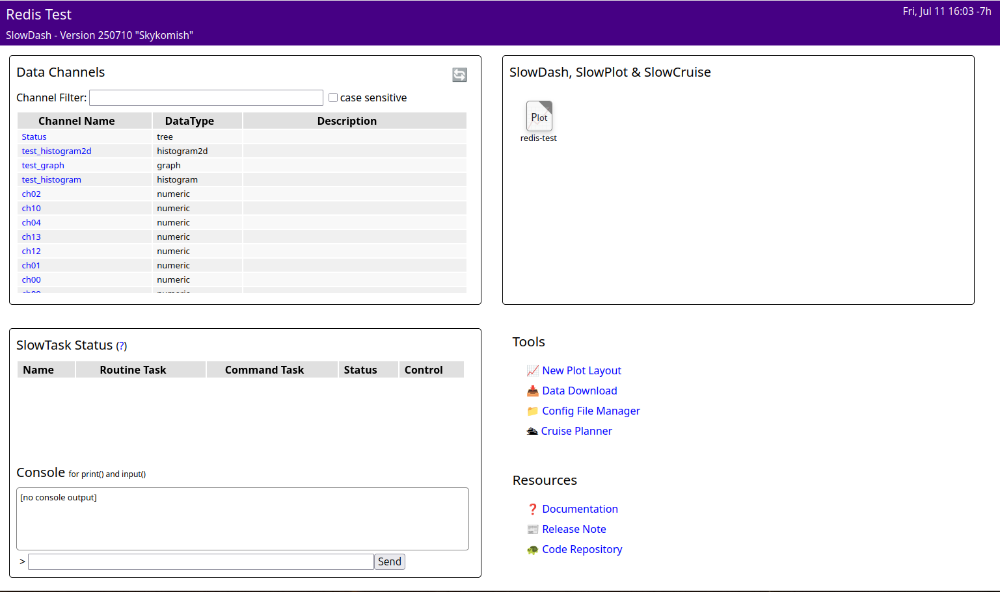
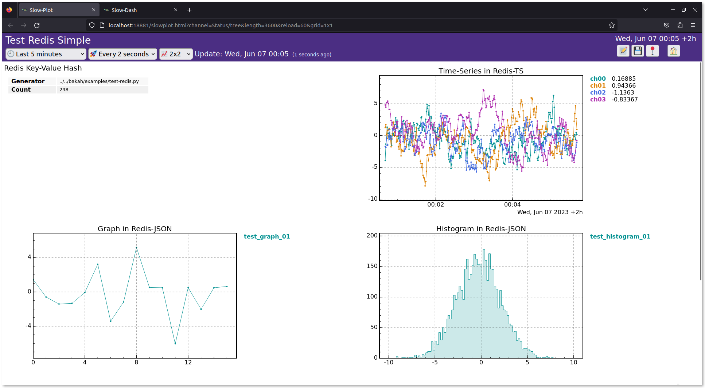

# できること
- Redis TS の時系列データをプロット
- 普通の Key-Value に入っている Redis ハッシュ値 (`RunNumber:12,Lapse:34,Operator:me` みたいなデータ) を表形式で表示
- Key-Value に Redis JSON (または普通の JSON 文字列) で入っているヒストグラムやグラフを描画
- Redis TS と Redis JSON (または普通の JSON 文字列) を組み合わせて作ったヒストグラムの時系列データに対して，時間範囲指定付きの描画

# インストール

## Docker を使う場合：Redis と SlowDash の一括インストールとテスト
`ExampleProjects/Test_Redis` に Redis Server と，SlowDash と，テストデータ生成スクリプトが全て入った `docker-compose.yaml` があるので，これを使う：
```console
$ cd PATH/TO/SLOWDASH/ExampleProjects/Test_Redis
$ docker-compose up
```

システムが立ち上がったら，ブラウザで `http://localhost:18881` にアクセス：
```console
$ firefox http://localhost:18881
```

ちなみに，`docker-compose.yaml` の中身はこんな感じ：
```
version: '3'

services:
  redis_server:
    image: redis/redis-stack:7.2.0-v10
    restart: always
    ports:
      - "6379:6379"
      - "8001:8001"

  slowdash:
    image: slowdash
    volumes:
      - .:/project
    ports:
      - "18881:18881"
    environment:
      - DB_URL=redis://redis_server:6379/12

  testdata:
    image: slowdash
    command: python /slowdash/utils/generate-testdata.py --db-url=redis://redis_server:6379/12
```
Redis Insight も入っているので，ブラウザで `http://localhost:8001` にアクセスすれば Redis のデータを見られる．


## Redis, Bare-Metal インストール

- Redis のサイトに行って Redis-Stack のイントール方法に従う： [https://redis.io/docs/stack/get-started/install/linux/](https://redis.io/docs/stack/get-started/install/linux/)

### CentOS7, 2023 年 6 月 6 日

#### Redis 本体 (Redis Stack)

以下のファイルを `/etc/yum.repos.d/redis.repo` に作成
```
[Redis]
name=Redis
baseurl=http://packages.redis.io/rpm/rhel7
enabled=1
gpgcheck=1
```
 
以下のコマンドを実行
```console
$ curl -fsSL https://packages.redis.io/gpg > /tmp/redis.key
$ sudo rpm --import /tmp/redis.key
$ sudo yum install epel-release
$ sudo yum install redis-stack-server
```
インストール直後
```console
$ sudo systemctl status redis-stack-server
● redis-stack-server.service - Redis stack server
   Loaded: loaded (/etc/systemd/system/redis-stack-server.service; disabled; vendor preset: disabled)
   Active: inactive (dead)
     Docs: https://redis.io/
```

スタートさせてみる
```console
$ sudo systemctl start redis-stack-server
$ sudo systemctl status redis-stack-server
● redis-stack-server.service - Redis stack server
   Loaded: loaded (/etc/systemd/system/redis-stack-server.service; disabled; vendor preset: disabled)
   Active: active (running) since 火 2023-06-06 12:40:11 PDT; 3s ago
     Docs: https://redis.io/
 Main PID: 4099 (redis-server)
    Tasks: 14
   CGroup: /system.slice/redis-stack-server.service
           └─4099 /opt/redis-stack/bin/redis-server *:6379

 6月 06 12:40:11 vs13centos7 redis-server[4099]: 4099:M 06 Jun 2023 12:40:11.578 * <ReJSON> version: 20007 git sha: e51b585 branch: HEAD
 6月 06 12:40:11 vs13centos7 redis-server[4099]: 4099:M 06 Jun 2023 12:40:11.578 * <ReJSON> Exported RedisJSON_V1 API
 6月 06 12:40:11 vs13centos7 redis-server[4099]: 4099:M 06 Jun 2023 12:40:11.578 * <ReJSON> Enabled diskless replication
 6月 06 12:40:11 vs13centos7 redis-server[4099]: 4099:M 06 Jun 2023 12:40:11.578 * <ReJSON> Created new data type 'ReJSON-RL'
 6月 06 12:40:11 vs13centos7 redis-server[4099]: 4099:M 06 Jun 2023 12:40:11.578 * Module 'ReJSON' loaded from /opt/redis-stack...son.so
 6月 06 12:40:11 vs13centos7 redis-server[4099]: 4099:M 06 Jun 2023 12:40:11.578 * <search> Acquired RedisJSON_V1 API
 6月 06 12:40:11 vs13centos7 redis-server[4099]: 4099:M 06 Jun 2023 12:40:11.578 * <graph> Acquired RedisJSON_V1 API
 6月 06 12:40:11 vs13centos7 redis-server[4099]: 4099:M 06 Jun 2023 12:40:11.578 * Module 'bf' loaded from /opt/redis-stack/lib...oom.so
 6月 06 12:40:11 vs13centos7 redis-server[4099]: 4099:M 06 Jun 2023 12:40:11.579 * The AOF directory appendonlydir doesn't exist
 6月 06 12:40:11 vs13centos7 redis-server[4099]: 4099:M 06 Jun 2023 12:40:11.579 * Ready to accept connections
Hint: Some lines were ellipsized, use -l to show in full.
$ redis-server --version
Redis server v=6.9.241 sha=00000000:0 malloc=jemalloc-5.2.1 bits=64 build=79cf147c911caf62
```
自動起動の設定
```console
$ sudo systemctl enable redis-stack-server
```

#### Python ライブラリ
```console
$ python3 --version
Python 3.6.8
```
Redis-py のページ([https://redis-py.readthedocs.io/en/stable/](https://redis-py.readthedocs.io/en/stable/))には Python 3.7+ と書いてあったけれど，CentOS7 の Python 3.6.8 でもいけた．
```console
$ pip3 install redis
Collecting redis
  Downloading https://files.pythonhosted.org/packages/d6/f6/19237b28c632935c7359bddf703395ba13bbd134fc5e2eb297c4c120398c/redis-4.3.6-py3-none-any.whl (248kB)
    100% |████████████████████████████████| 256kB 2.4MB/s 
Collecting typing-extensions; python_version < "3.8" (from redis)
  Downloading https://files.pythonhosted.org/packages/45/6b/44f7f8f1e110027cf88956b59f2fad776cca7e1704396d043f89effd3a0e/typing_extensions-4.1.1-py3-none-any.whl
Collecting importlib-metadata>=1.0; python_version < "3.8" (from redis)
  Downloading https://files.pythonhosted.org/packages/a0/a1/b153a0a4caf7a7e3f15c2cd56c7702e2cf3d89b1b359d1f1c5e59d68f4ce/importlib_metadata-4.8.3-py3-none-any.whl
Collecting packaging>=20.4 (from redis)
  Downloading https://files.pythonhosted.org/packages/05/8e/8de486cbd03baba4deef4142bd643a3e7bbe954a784dc1bb17142572d127/packaging-21.3-py3-none-any.whl (40kB)
    100% |████████████████████████████████| 40kB 7.2MB/s 
Collecting async-timeout>=4.0.2 (from redis)
  Downloading https://files.pythonhosted.org/packages/d6/c1/8991e7c5385b897b8c020cdaad718c5b087a6626d1d11a23e1ea87e325a7/async_timeout-4.0.2-py3-none-any.whl
Collecting zipp>=0.5 (from importlib-metadata>=1.0; python_version < "3.8"->redis)
  Downloading https://files.pythonhosted.org/packages/bd/df/d4a4974a3e3957fd1c1fa3082366d7fff6e428ddb55f074bf64876f8e8ad/zipp-3.6.0-py3-none-any.whl
Collecting pyparsing!=3.0.5,>=2.0.2 (from packaging>=20.4->redis)
  Downloading https://files.pythonhosted.org/packages/6c/10/a7d0fa5baea8fe7b50f448ab742f26f52b80bfca85ac2be9d35cdd9a3246/pyparsing-3.0.9-py3-none-any.whl (98kB)
    100% |████████████████████████████████| 102kB 9.0MB/s 
Installing collected packages: typing-extensions, zipp, importlib-metadata, pyparsing, packaging, async-timeout, redis
Successfully installed async-timeout-4.0.2 importlib-metadata-4.8.3 packaging-21.3 pyparsing-3.0.9 redis-4.3.6 typing-extensions-4.1.1 zipp-3.6.0
```

使ってみる

```console
$ python3
Python 3.6.8 (default, Nov 16 2020, 16:55:22) 
[GCC 4.8.5 20150623 (Red Hat 4.8.5-44)] on linux
Type "help", "copyright", "credits" or "license" for more information.
>>> import redis
>>> r = redis.Redis()
>>> r.ping()
True
>>> 
 ```

### Ubuntu 20.04, 2023 年 6 月 6 日
#### Redis 本体 (Redis Stack)
```console
$ curl -fsSL https://packages.redis.io/gpg | sudo gpg --dearmor -o /usr/share/keyrings/redis-archive-keyring.gpg
$ sudo chmod 644 /usr/share/keyrings/redis-archive-keyring.gpg
$ echo "deb [signed-by=/usr/share/keyrings/redis-archive-keyring.gpg] https://packages.redis.io/deb $(lsb_release -cs) main" | sudo tee /etc/apt/sources.list.d/redis.list
$ sudo apt-get update
$ sudo apt-get install redis-stack-server
```

#### Python ライブラリ
```
$ pip3 install redis
```

## SlowDash, Bare-Metal インストール
### Python インストール
- python3
- pip3: pyyaml, numpy

### SlowDash インストール
```bash
$ git clone https://github.com/slowproj/slowdash.git --recurse-submodules
$ cd system; make
$ cd ..; source bin/slowdash-bashrc  # 毎回やるか，`.bashrc`  に書く
```

### 動作確認
#### テストデータの生成
<strong>以下のダミーデータ生成スクリプトは，既存の Redis データがあるとその内容と干渉する可能性があります．すでにデータがある場合はこの手順をスキップして，手持ちのデータを使う方がいいです．</strong>

SlowDash に入っている Python ライブラリ SlowPy を使う．SlowPy は Python パッケージだけれど，今回はインストールせずに使うので，環境変数を設定する．それをする bash のスクリプトを `source` する：
```console
$ source PATH/TO/SLOWDASH/bin/slowdash-bashrc
```

これでダミーデータを生成するスクリプトが走るはず：
```console
$ PATH/TO/SLOWDASH/utils/generate-testdata.py --db-url=redis://redis_server:6379/1
[{'key': 'test_graph_01'}, {'key': 'test_histogram_01'}]
[{'key': 'ch00', 'totalSamples': 1, 'firstTimeStamp': None, 'lastTimeStamp': None, 'retentionTime': 3600000}, {'key': 'ch10', 'totalSamples': 1, 'firstTimeStamp': None, 'lastTimeStamp': None, 'retentionTime': 3600000}, {'key': 'ch14', 'totalSamples': 1, 'firstTimeStamp': None, 'lastTimeStamp': None, 'retentionTime': 3600000}, {'key': 'ch04', 'totalSamples': 1, 'firstTimeStamp': None, 'lastTimeStamp': None, 'retentionTime': 3600000}, {'key': 'ch15', 'totalSamples': 1, 'firstTimeStamp': None, 'lastTimeStamp': None, 'retentionTime': 3600000}, {'key': 'ch03', 'totalSamples': 1, 'firstTimeStamp': None, 'lastTimeStamp': None, 'retentionTime': 3600000}, {'key': 'ch11', 'totalSamples': 1, 'firstTimeStamp': None, 'lastTimeStamp': None, 'retentionTime': 3600000}, {'key': 'ch02', 'totalSamples': 1, 'firstTimeStamp': None, 'lastTimeStamp': None, 'retentionTime': 3600000}, {'key': 'ch09', 'totalSamples': 1, 'firstTimeStamp': None, 'lastTimeStamp': None, 'retentionTime': 3600000}, {'key': 'ch08', 'totalSamples': 1, 'firstTimeStamp': None, 'lastTimeStamp': None, 'retentionTime': 3600000}, {'key': 'ch13', 'totalSamples': 1, 'firstTimeStamp': None, 'lastTimeStamp': None, 'retentionTime': 3600000}, {'key': 'ch05', 'totalSamples': 1, 'firstTimeStamp': None, 'lastTimeStamp': None, 'retentionTime': 3600000}, {'key': 'ch06', 'totalSamples': 1, 'firstTimeStamp': None, 'lastTimeStamp': None, 'retentionTime': 3600000}, {'key': 'ch01', 'totalSamples': 1, 'firstTimeStamp': None, 'lastTimeStamp': None, 'retentionTime': 3600000}, {'key': 'ch07', 'totalSamples': 1, 'firstTimeStamp': None, 'lastTimeStamp': None, 'retentionTime': 3600000}, {'key': 'ch12', 'totalSamples': 1, 'firstTimeStamp': None, 'lastTimeStamp': None, 'retentionTime': 3600000}]
[{'key': 'test_graph_02', 'totalSamples': 1, 'firstTimeStamp': None, 'lastTimeStamp': None, 'retentionTime': 3600000}, {'key': 'test_histogram_02', 'totalSamples': 1, 'firstTimeStamp': None, 'lastTimeStamp': None, 'retentionTime': 3600000}]
```

#### SlowDash の実行テスト
上記データ生成コマンドを走らせたまま別ウィンドウで SlowDash を走らせる：

```console
$ cd PATH/TO/SLOWDASH/ExampleProjects/Test_Redis
$ slowdash channels
[{"name": "Status", "type": "tree"}, {"name": "test_graph_01", "type": "graph"}, {"name": "test_histogram_01", "type": "histogram"}, {"name": "ch00", "type": "timeseries"}, {"name": "ch10", "type": "timeseries"}, {"name": "ch14", "type": "timeseries"}, {"name": "ch04", "type": "timeseries"}, {"name": "ch15", "type": "timeseries"}, {"name": "ch03", "type": "timeseries"}, {"name": "ch11", "type": "timeseries"}, {"name": "ch02", "type": "timeseries"}, {"name": "ch09", "type": "timeseries"}, {"name": "ch08", "type": "timeseries"}, {"name": "ch13", "type": "timeseries"}, {"name": "ch05", "type": "timeseries"}, {"name": "ch06", "type": "timeseries"}, {"name": "ch01", "type": "timeseries"}, {"name": "ch07", "type": "timeseries"}, {"name": "ch12", "type": "timeseries"}]
```

 ちゃんとデータが見えているので，ポート番号を指定して SlowDash を走らせる：

 ```console
 $ slowdash --port=18881
 ```

 ブラウザで `http://localhost:18881/` に接続．

 ```console
 $ firefox http://localhost:18881/
 ```
 
 
 左下の Channel List にチャンネルが表示されていることを確認．
<p>
 右上の Slow-Plot にある `redis-test` をクリックしてデータパネルを表示する：
 


# 使い方
## プロジェクト設定
動作テストに使った `ExampleProjects/Test_Redis` の `SlowdashProject.yaml` にあるように，Redis サーバのアドレス，ポート番号とデータベース番号を指定するだけで良い．

```yaml
slowdash_project:
  data_source:
    url: redis://localhost:6379/1
```

複数のデータベース番号を使いたいときは，`data_source` を配列にできる．ただし，これは省略形式で，正式には，以下のようにデータ形式ごとにエントリを作る．こうするとよりきめ細かくパラメータを設定できる．
```yaml
slowdash_project:
  name: RedisTest
  title: Redis Test, Simple version

  data_source:
    type: Redis
    parameters:
      url: redis://localhost:6379/
      hash: { db: 1 }
      time_series: 
        - db: 2
        - db: 3
          suffix: '.second_TS'
      object: { db: 1 }
```

|エントリ名|データ|
|----------|----------|
|`hash`    | Redis ハッシュ値が SlowDash の Tree として読まれる|
|`time_series` | Redis TS 値が SlowDash の TimeSeries として読まれる|
|`object` | Redis JSON 値が SlowDash の Histogram / Graph / etc. として読まれる|
|`object_time_series` | Redis TS と Redis JSON を組み合わせた SlowDash 形式でオブジェクトの時系列が格納されている場合 |

複数のデーターベース間でキーの重複がある場合は，`suffix` パラメータを指定すると，SlowDash チャンネル名にサフィックスが付いて区別できる．

## データ形式
### 時系列データ
Redis TimeSeries で記録したデータは自動で検出され，チャンネルリストに表示される．

### ハッシュ値
Redis の通常の Key-Value でハッシュ値を記録した場合，SlowDash の Tree 型として取り込まれる．動作テスト例の左上のパネル．

### ヒストグラムとグラフ (最新値のみ保持の簡単な場合)
Redis JSON を使って特定の構造の JSON オブジェクトを記録すると SlowDash にヒストグラムやグラフとして認識される．

Python のコードはこんな感じ：
```python
import redis
r = redis.Redis('localhost', 6379, 1)
hist = {
  'bins': { 'min': 0, 'max': 100 },
  'counts': [ 3, 5, 8, 14, 11, 3, 6, 4, 4, 1 ]
}
r.json().set('hist00', '$', hist)
```
あるいは，普通の Key-Value に，JSON 文字列で保存しても良い (C++ とかからならこちらの方が便利かも)：
```python
import redis
r = redis.Redis('localhost', 6379, 1)
hist = '''{
  "bins": { "min": 0, "max": 100 },
  "counts": [ 3, 5, 8, 14, 11, 3, 6, 4, 4, 1 ]
}'''
r.set('hist00', hist)
```

JSON のデータ構造は以下の通り：

##### ヒストグラム
```json
{ 
    "bins": {"min": MIN, "max": MAX}, 
    "counts": [C0, C1, C2, ...] 
}
```
- `counts` があることにより，この JSON がヒストグラムだと判別される．
- ビンは現在のところ等間隔のみ．ビン数は `counts` 配列の長さで決められる．
  
##### グラフ
```json
{ 
    "labels": [ XLABEL, YLABEL ],
    "x": [x0, x1, x2, ...],
    "y": [y0, y1, y2, ...],    
}
```
- `y` があることにより，この JSON がグラフだと判別される．

##### それ以外
[Data Model](DataModel.html#value-types-and-json-representation) を参照．

### ヒストグラムやグラフの時系列
Redis TimeSeries と Redis JSON を組み合わせて実現されている．構造が面倒なので，SlowPy ライブラリを使うのが便利だと思う．

こんな感じ：
```python
import sys, os, time
import numpy as np
import slowpy as slp
    
datastore = slp.DataStore_Redis(host='localhost', port=6379, db=2, retention_length=3600)
histogram = slp.Histogram('test_histogram_01', 100, -10, 10)

while True:
    for i in range(100):
        h.fill(np.random.normal(5, 2))

    # これ
    datastore.write_object_timeseries(histogram)
    
    time.sleep(1)
```

現時点では，通常の時系列データとヒストグラムやグラフの時系列データは同じデータベースに共存できないので，この例ではデータベース番号 2 を使用している．

ちなみに，`write_object_timeseries()` の代わりに `write_object()` とすると，時刻情報なしで最新版だけを同じキーで保存するようになる（上記の例）．
