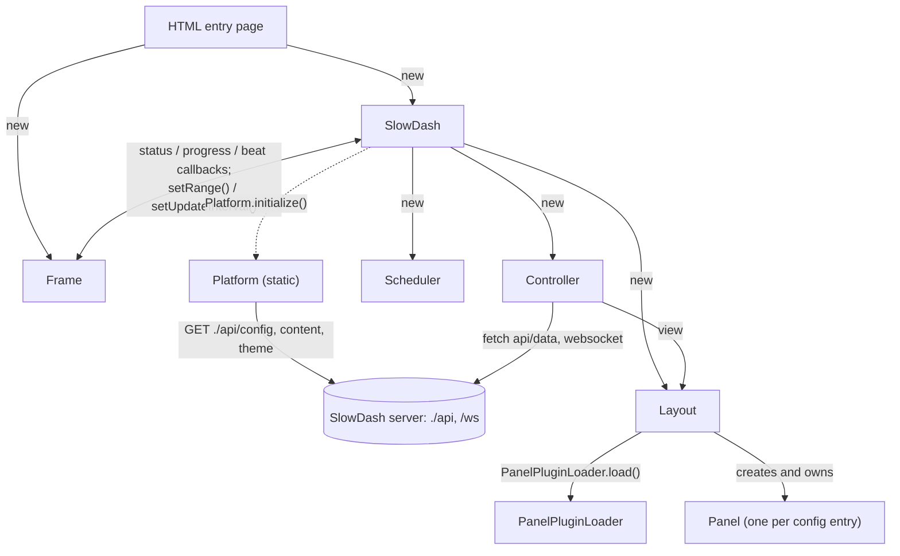
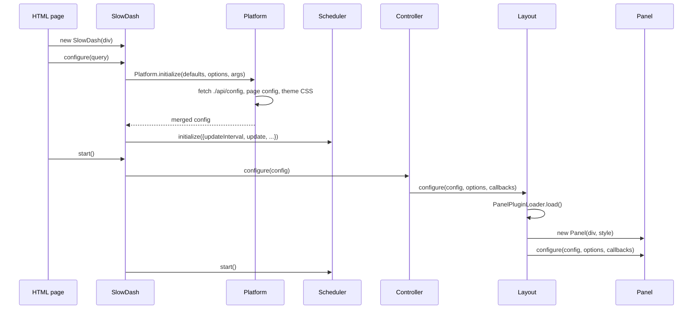
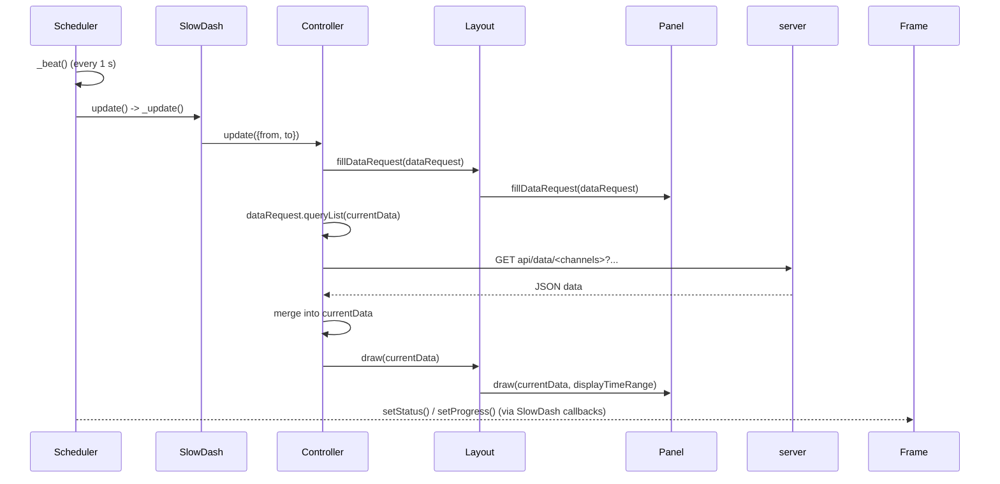
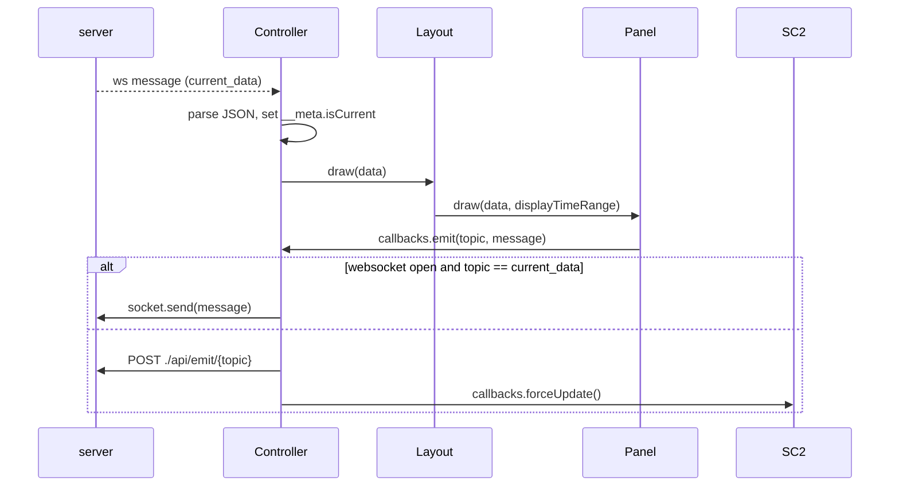

# 全体構造

`app/site` のフロントエンドは，静的な HTML エントリーページと，`app/site/slowjs` 以下の ES モジュールから構成される，ブラウザ側のアプリケーションです．

```text
HTML entry pages
    |
    v
slowjs core modules
    - platform/config loading
    - dashboard orchestration
    - scheduler/controller
    - layout and panel management
    |
    v
panel modules
    - plots
    - canvas views
    - tables/trees/blobs
    - HTML/href panels
    - catalogs/download/tools/task manager
    |
    v
submodules and external browser libraries
    - jagaimo DOM/widget/plot helpers
    - autocruise rotating dashboard viewer
    - ace-builds editor bundle
```

メインのダッシュボードの経路は次のとおりです．

```text
slowdash.html or slowplot.html
    -> slowjs/slowdash.mjs
    -> Platform
    -> SlowDash
    -> Layout
    -> Controller
    -> Scheduler
    -> Panel modules
```

# 主要ファイル

### HTML エントリーページ

`app/site` には，ページ単位のエントリーポイントが複数あります．

- `slowdash.html`: メインのダッシュボードの表示/編集用エントリーポイント．
- `slowplot.html`: プロット中心のエントリーポイント．
- `slowhome.html`: ホーム/コンテンツ一覧ページ．
- `slowdown.html`: レイアウト/ダッシュボードの表示ページ．
- `slowedit.html`: Ace を使う設定エディタ．
- `slowedit2.html`: Monaco を使う代替の設定エディタ（CDN から読み込み）．
- `slowfile.html`: ファイル向けのページ．
- `slowplan.html`: 計画用ページ．
- `slowcruise.html`: autocruise のエントリーポイント．
- `welcome.html`: ウェルカムページ．

ほとんどのページは `slowjs/slowdash.css` を読み込み，`<script type="module">` を使って `slowjs` から ES モジュールをインポートします．

`slowcruise.html` だけは異なり，`slowjs/autocruise/autocruise.js` を従来型のスクリプトとして読み込みます．

### コアとなる `slowjs` モジュール

- `slowdash.mjs`: ダッシュボード全体の調整役．
- `platform.mjs`: プロジェクト/ページ設定の読み込み，テーマの読み込み，データ一覧の準備，アップロード/保存ダイアログ．
- `control.mjs`: `DataRequest`，`Controller`，`Scheduler`，更新ループ，API の取得，websocket ストリーミング．
- `layout.mjs`: パネルのグリッドレイアウト，パネルの生成，パネルの設定，再描画．
- `frame.mjs`: ページフレームのウィジェット，時間範囲のコントロール，グリッドのコントロール．
- `panel.mjs`: 基底の `Panel` クラスと，共通のパネルヘルパー．
- `panel-plugin-loader.mjs`: 組み込みおよび任意のパネルモジュールの動的ローダ．
- `transformer.mjs`: パネルで使う値の変換関数．

### 組み込みパネルモジュール

- `panel-plot.mjs`: 時系列，ヒストグラム，グラフ，散布図，マーカー，棒，時間軸のプロットパネル．
- `panel-singles.mjs`: 単一値の表示と，ステータス表示のような四角形の表示．
- `panel-canvas.mjs`: 図形，ボタン，画像，microplot，viewlet などを含む，canvas ベースのプロセス表示パネル．
- `panel-map.mjs`: マップパネルのサポート．
- `panel-table.mjs`: テーブル，ツリー，blob のパネル．
- `panel-html.mjs`: 埋め込み HTML とハイパーリンクのパネル．
- `panel-catalog.mjs`: コンテンツカタログとチャンネル一覧のパネル．
- `panel-download.mjs`: データのダウンロードと SlowPy ヘルパーのパネル．
- `panel-misc.mjs`: ウェルカム，ツール，ファイルマネージャ，タスクマネージャ，cruise プランナ，設定エディタのパネル．

### スタイルとアセット

- `slowjs/slowdash.css`: 共通のフロントエンドスタイル．
- `slowjs/slowdash-light.css`: ライトテーマ．
- `slowjs/slowdash-dark.css`: ダークテーマ．
- `slowjs/Warning.png`: canvas/パネルのコードで使う警告アイコン．
- `favicon.png`: サイトの favicon．

### サブモジュールと外部依存

リポジトリの `.gitmodules` では，フロントエンド用に次の 3 つのサブモジュールが宣言されています．

```text
app/site/slow-extern/ace-builds
app/site/slowjs/jagaimo
app/site/slowjs/autocruise
```

この文書では，SlowDash のブラウザ UI モデルに直接関わる `jagaimo` と `autocruise` を中心に扱います．`ace-builds` は，`slowedit.html` でエディタのバンドルとして使われます．

# エントリーページのパターン

### ダッシュボード形式のページ

ダッシュボード形式のページは，`SlowDash`，`Frame`，および必要に応じて追加のコントロールウィジェットをインポートします．

```text
slowdash.html
slowplot.html
slowfile.html
slowhome.html
slowplan.html
```

典型的なパターンは次のとおりです．

1. `jagaimo` から `JG` をインポートする．
2. `slowdash.mjs` から `SlowDash` をインポートする．
3. `Frame`，または時間/グリッドのコントロールをインポートする．
4. URL のオプションを読む．
5. フレーム/ヘッダ/ボディの要素を作る．
6. `SlowDash` のインスタンスを作る．
7. 設定ファイル名，URL クエリ，またはインラインの設定データで設定する．
8. scheduler/controller のループを開始する．

### 設定エディタのページ

`slowedit.html` と `slowedit2.html` はエディタページです．

- `slowedit.html` はローカルの `slow-extern/ace-builds` を使います．
- `slowedit2.html` は `https://unpkg.com/monaco-editor/...` から Monaco を読み込みます．

どちらも，次のような SlowDash の設定 API を呼び出します．

```text
GET /api/config/file/{filename}
GET /api/config/contentlist
POST /api/config/file/{filename}
```

### autocruise ページ

`slowcruise.html` は `autocruise` サブモジュールを読み込みます．

```html
<script type="text/javascript" src="slowjs/autocruise/autocruise.js"></script>
<body autocruise-configbase="api/config/content/" autocruise-interval="10">
```

これは，`autocruise.js` を使って複数のダッシュボード/設定ページを巡回表示します．

# メインダッシュボードの実行時フロー

メインのダッシュボードオブジェクトは，`slowdash.mjs` の `SlowDash` です．

```text
new SlowDash(div, config, options)
    |
    +-- creates Layout
    +-- creates Controller
    +-- creates Scheduler
```

### 設定のフロー

```text
SlowDash.configure(config, options)
    |
    v
_buildConfig(...)
    |
    v
Platform.initialize(defaults, options, args)
    |
    +-- GET ./api/config
    +-- optional GET ./api/config/content/{config_file}
    +-- load theme CSS slowjs/slowdash-{theme}.css
    |
    v
merged config object
```

`config` には，次の形式を使えます．

- URL クエリ文字列．
- 設定ファイル名．
- 設定オブジェクト．

設定が `panels` ではなく `items` を持つ場合，`SlowDash` はそれを canvas 形式の設定とみなし，単一の canvas パネルにラップします．

### URL クエリオプション

`config` がクエリ文字列の場合（`slowdash.html` のように），`SlowDash._buildSettings()` が URL パラメータを設定値に対応づけます．

```text
config=<name>        ./api/config/content/ から名前付きのページ設定を読み込む
configdata=<base64>  インラインの base64 エンコード済み設定を読み込む（ポップアウトで使用）
mode=normal|protected|display
theme=<name>         slowjs/slowdash-<name>.css を読み込む
time=<datetime>      時間範囲の終端
to=<datetime>        time と同じ
length=<seconds>     時間範囲の長さ（10 より大きいこと）
reload=<seconds>     自動リロード間隔（1 以上），-1 = オフ，0 = 1 回のみ
grid=<rows>x<cols>   パネルのグリッドサイズ
channel=<spec>       チャンネルから直接パネルを構築する（下記参照）
```

これらの URL の値は `args` にまとめられ，`Platform` でのディープマージの際に，プロジェクト設定やページ設定よりも優先されます．

`channel` オプションは，保存済みの設定なしにパネルを構築します．セミコロン区切りの各項目は `channels/type` の形式で，`channels` はカンマ区切りのチャンネル一覧，`type` は `timeseries`（デフォルト），`histogram`，`ts-histogram`，`histogram2d`，`graph`，`singles`，`table`，`tree`，`blob` のいずれかです．

```text
slowdash.html?channel=ch0,ch1;ch2/histogram&length=3600
```

### 開始のフロー

```text
SlowDash.start()
    |
    v
configure if needed
    |
    v
Controller.configure(config)
    |
    v
Layout.configure(config)
    |
    v
PanelPluginLoader.load()
    |
    v
build and configure panel instances
    |
    v
Scheduler.start()
```

# Platform モジュール

`platform.mjs` は，プロジェクト/ページのセットアップを集約します．

主な責務は次のとおりです．

- URL のオプションを解析する．
- `./api/config` からプロジェクト設定を取得する．
- `./api/config/content/{config_file}` からページ設定を取得する．
- URL 中のインライン base64 設定データをデコードする．
- テーマの CSS を動的に読み込む．
- チャンネルセレクタやコンテンツセレクタ用の `<datalist>` を作る．
- ファイルや設定をサーバーのエンドポイントにアップロードする．
- `SaveConfigDialog` を提供する．

主なサーバー呼び出しは次のとおりです．

```text
GET  ./api/config
GET  ./api/config/content/{filename}
GET  api/channels?fields=name
GET  ./api/config/contentlist
POST ./api/{filename}
```

最終的な設定は，次をディープマージして作られます．

```text
defaults
project/page config
explicit args
```

# Controller，Scheduler，データリクエスト

### `DataRequest`

`DataRequest` は，`GET /api/data` 用のチャンネルリクエスト群を作ります．

保持するものは次のとおりです．

- デフォルトのリクエストオプション．
- デフォルトのチャンネルリクエスト．
- カスタムのチャンネルリクエスト．

時間範囲が長すぎない場合，複数のデフォルトチャンネルリクエストを 1 回の API 呼び出しにまとめられます．

```text
api/data/ch1,ch2,ch3?length=...&to=...&resample=...
```

各リクエストは，次のデフォルト値を持つオプション群を伴います．

```text
length, to        時間範囲
resample = -1     ビン幅（秒）（-1 = リサンプリングなし）
reducer = 'last'  ビン内の集約方法 last/mean/median/min/max/count/sem
filler = 'fillna' 欠損の補間方法
envelope = 0      リサンプリング時に最小/最大のエンベロープを含める
prior_data = 0    範囲の直前のデータ点を 1 つ含める
```

これらのオプションは，サーバー側で `DataSource` が解析するパラメータ（`length`，`to`，`resample`，`reducer`，`filler`，`envelope`，`prior_data`）と対応します．要求された `length` が `resamplingThreshold`（デフォルト 7200 秒）を超えると，`DataRequest` は `resample` を `length / resamplingBuckets`（デフォルト 600 バケット）に自動設定し，長い範囲はサーバーへ送る前にダウンサンプリングされます．

カスタムリクエストは，パネル固有のオプションがデフォルトリクエストと干渉しないよう，個別のリクエストのまま扱われます．

### `Controller`

`Controller` は，レイアウト/パネルとサーバーデータをつなぐ実行時のブリッジです．

主な責務は次のとおりです．

- `Layout` を設定する．
- 各パネルに必要なデータを問い合わせて `DataRequest` を作る．
- `api/data/...` からデータを取得する．
- 受け取ったデータを `currentData` にマージする．
- `Layout` にパネルの描画を依頼する．
- `/api/emit/{topic}` にメッセージを送出する．
- `current_data` 用の websocket ストリーミングを維持する．

データ更新のフローは次のとおりです．

```text
Scheduler.update()
    |
    v
Controller.update()
    |
    v
Layout.fillDataRequest(dataRequest)
    |
    v
DataRequest.queryList(existingData)
    |
    v
fetch('api/data/' + query)
    |
    v
merge JSON response into currentData
    |
    v
Layout.draw(currentData)
```

蓄積されたデータは `Controller.currentData` に保持され，これが `view.draw()` に渡されるパケットになります．これは，リクエスト ID（チャンネル名，またはカスタムリクエストの ID）をキーとする辞書に，パケットを説明する `__meta` エントリを加えたものです．

```text
currentData = {
    "<channel-or-request-id>": <SlowDash のデータオブジェクト>,
    ...
    __meta: {
        range: { from, to },
        isPartial,        // 複数クエリの更新がまだ進行中の間は true
        isCurrent,        // websocket でプッシュされた現在値データなら true
        currentDataTime,  // プッシュされた現在値データのタイムスタンプ
    }
}
```

`DataRequest.queryList()` は，すでに `currentData` に存在するリクエスト ID をスキップします．そのため，時間範囲が変わらない場合は再取得せず，以前に読み込んだデータを再利用します．複数クエリの更新では，クエリが残っている間は `isPartial` を立て，最後のクエリが完了した時点で一度だけビューを再描画します．

送出（emit）のフローは次のとおりです．

```text
Panel or view callback
    |
    v
Controller.emit(topic, doc)
    |
    +-- if websocket is open and topic == current_data:
    |       socket.send(message)
    |
    +-- otherwise:
            POST ./api/emit/{topic}
```

### WebSocket ストリーミング

`Controller` は，次の websocket への接続を試みます．

```text
ws://.../ws/attach/current_data
wss://.../ws/attach/current_data
```

URL は現在のページ URL から作られます．websocket のセットアップに失敗した場合，データのストリーミングは無効化され，ダッシュボードは HTTP ポーリングを継続します．

受信した websocket メッセージは現在値データとして解析され，アクティブなビューに渡されます．

```text
WebSocket message
    |
    v
parse JSON
    |
    v
merge/update current data
    |
    v
view.draw(data)
```

### `Scheduler`

`Scheduler` は，定期的な更新，保留中の更新リクエスト，リセットのタイミング，サスペンドの挙動，ステータス/進捗のコールバックを制御します．

`SlowDash.configure()` によって，次を渡されて初期化されます．

- 更新間隔．
- リセットの遅延時間．
- `SlowDash._update()` へのコールバック．
- ステータス/進捗/拍時刻（beat-time）のコールバック．

スケジューラは 1 秒ごとの `_beat()` ループを回し，ステータス/進捗の表示を更新し，更新間隔が経過したら `update()` を呼び出します．さらに，リセット遅延が設定されている場合は，その遅延の経過後にページをリロードします．リセット遅延は制御モードから決まります．

```text
normal     -> 0   （自動リセットなし）
protected  -> 300 秒
display    -> 10 秒
```

`update()` はリクエストをまとめます．更新がすでに実行中のときに呼ばれた場合は，2 つ目のクエリを開始せず保留中のリクエストとして記録し，その保留分は次の beat で実行されます．

# レイアウトとパネルモデル

### `Layout`

`Layout` は，視覚的なパネルのグリッドを管理します．

主な責務は次のとおりです．

- `PanelPluginLoader` を通じてパネルクラスを読み込む．
- 設定の構造を正規化する．
- グリッドとパネルの寸法を計算する．
- パネルの `<div>` 要素を作る．
- 設定エントリごとに，適切なパネルクラスをインスタンス化する．
- 各パネルを設定する．
- 現在のデータパケットで全パネルを描画する．
- 編集が許可されている場合，追加/削除/再設定の操作を提供する．

パネル生成のフローは次のとおりです．

```text
Layout.configure(config)
    |
    v
PanelPluginLoader.load()
    |
    v
_buildPanels()
    |
    v
_createPanel(panelDiv, panelType)
    |
    v
_configurePanels()
```

### `Panel`

`panel.mjs` は，基底の `Panel` クラスを定義します．

パネルの責務は次のとおりです．

- パネルの config/options/callbacks を保持する．
- 標準的な configure/draw のフックを提供する．
- 設定ダイアログの挙動を提供する．
- 削除/再設定のコールバックを提供する．
- 各パネルが `DataRequest` に必要なデータを追加できるようにする．

主なメソッドは次のとおりです．

```text
configure(config, options, callbacks)
fillDataRequest(dataRequest)
draw(dataPacket, displayTimeRange)
```

サブクラスはこれらをオーバーライドし，具体的な表示タイプを実装します．

### `PanelPluginLoader`

`panel-plugin-loader.mjs` は，パネルモジュールを動的にインポートし，`Panel` を継承した export 済みクラスを抽出します．

コアモジュールは「add panel」UI の表示順を予測可能にするため，固定の順序で読み込まれます．

```text
panel-plot.mjs
panel-singles.mjs
panel-canvas.mjs
panel-map.mjs
panel-table.mjs
panel-html.mjs
panel-catalog.mjs
panel-download.mjs
panel-misc.mjs
```

追加のパネルプラグインファイルは，`add_plugin(filepath)` で追加できます．

# モジュールの関係と呼び出しシーケンス

ここでは，`SlowDash`，`Frame`，`Platform`，`Scheduler`，`Controller`，`Layout`，`Panel` が互いにどう関係し，主要なフローがどのように駆動されるかをまとめます．

## 所有関係と参照

HTML エントリーページが `SlowDash` と `Frame` を生成し，両者を接続します．`SlowDash` は `Layout`，`Controller`，`Scheduler` を生成します．`Controller` は `Layout` を自身のビューとして保持し，`Layout` が `Panel` インスタンスを生成・所有します．`Platform` は静的なヘルパーで，インスタンス化されません．



## 起動シーケンス

`configure()` は `Platform` を通じてマージ済みの設定を構築し，`Scheduler` を初期化します．`start()` は `Controller`（およびそれを介して `Layout` と各 `Panel`）を設定し，`Scheduler` を開始します．



## 更新ループのシーケンス

`Scheduler` は 1 秒ごとの beat を回します．更新の時期になると `SlowDash._update()` を呼び戻し，これが `Controller` に対して，各パネルからのデータリクエストの収集，データの取得，再描画を依頼します．



## ストリーミングと emit のシーケンス

現在値データの更新は，スケジューラを経由せず websocket 経由で届くこともあります．パネルのコールバックは，制御メッセージや現在値データを `Controller` を通じて送り返します．



ここで `SC2` は前掲と同じ `Scheduler` で，`forceUpdate()` は emit 後に即時の再描画を要求します．

# 組み込みパネルモジュール

### プロットパネル

`panel-plot.mjs` は，次を export します．

- `TimeAxisPlotPanel`
- `PlotPanel`

内部には，次のプロット実装があります．

- 時系列プロット．
- ヒストグラム．
- 2D ヒストグラム．
- グラフ．
- 折れ線/マーカープロット．
- 棒グラフ．
- 時系列の散布図．

プロットウィジェットと軸のスケーリングには，`jagaimo/jagaplot.mjs` を使います．

### singles パネル

`panel-singles.mjs` は，単一値とステータス表示のパネルを実装します．

使用するものは次のとおりです．

- 値の変換用の `Transformer`．
- 視覚的なスケーリング用の `JGPlotAxisScale`．
- 設定 UI 用のタブウィジェット．

### canvas パネル

`panel-canvas.mjs` は，canvas/プロセスビュー形式のダッシュボードを実装します．

含まれるアイテムクラスは次のとおりです．

- 画像．
- テキスト．
- 図形．
- ボックスと円．
- バルブとソレノイド．
- グリッド．
- ボタン．
- プロットと microplot．
- viewlet．

canvas のアイテムは，データを読み，SVG/HTML 要素を描画し，コールバック経由で制御メッセージを送出できます．

### map パネル

`panel-map.mjs` は，次のエンドポイントからマップ設定を読み込みます．

```text
GET ./api/config/file/map-{name}.json
```

マップのジオメトリとカラースケールを使い，チャンネルベースのマップ表示を描画します．

### テーブル，ツリー，blob パネル

`panel-table.mjs` は，3 つのパネルクラスをエイリアス付きで export します．

```text
TablePanel as Panel1
TreePanel  as Panel2
BlobPanel  as Panel3
```

`BlobPanel` は，次の API で blob のコンテンツを取得できます．

```text
GET ./api/blob/{channel}?id={id}
```

### HTML と href パネル

`panel-html.mjs` は，次を export します．

```text
HtmlPanel as Panel1
HrefPanel as Panel2
```

できることは次のとおりです．

- プロジェクト設定のコンテンツから HTML コンテンツを読み込む．
- システムまたは外部のコンテンツを読み込む．
- 表示用に値を変換する．
- `./api/control` に制御メッセージを送る．

### カタログとチャンネル一覧のパネル

`panel-catalog.mjs` は，次を提供します．

- `CatalogPanel`
- `ChannelListPanel`

設定済みの SlowDash コンテンツを一覧・オープンするため，次を使います．

```text
GET ./api/config/contentlist
GET ./api/config/content/{filename}
```

### ダウンロードと SlowPy パネル

`panel-download.mjs` は，次を含みます．

- `DownloadPanel`
- `SlowpyPanel`

チャンネルを一覧し，エクスポート/ダウンロードのリクエストを作り，ダウンロード可能なデータ成果物のためのサーバーリクエストを送れます．

### その他のパネル

`panel-misc.mjs` は，次を export します．

- `WelcomePanel`
- `ToolsPanel`
- `FileManagerPanel`
- `TaskManagerPanel`
- `CruisePlannerPanel`
- `ConfigEditorPanel`

これらのパネルは，次のような API を使います．

```text
GET  ./api/config/filelist
GET  ./api/config/file/{filename}
POST ./api/config/file/{filename}
GET  api/control/task?since={revision}
POST ./api/control/task/{taskname}
GET  api/console?since={revision}
POST ./api/console/
```

# Transformer モジュール

`transformer.mjs` は，組み合わせ可能な値変換のシステムを提供します．

内部の functor クラスは，次のような操作を扱います．

- スカラー変換．
- オフセット．
- スケール．
- フォーマット．
- マッチング．
- 置換．
- 等価比較．
- 大小比較．
- 反転．
- デフォルト値．
- 「last」の抽出．
- オブジェクトのフィールド参照．

`Transformer` は表示パネルで，生のチャンネル値をテキスト，色，しきい値，ラベル，その他の表示用の値に変換するために使われます．

# Frame モジュール

`frame.mjs` は，ページ単位の共通 UI コントロールを提供します．

export するものは次のとおりです．

- `Frame`
- `TimePullDown`
- `TimeRangePullDown`
- `GridPullDown`

これらは，ダッシュボードのページで次を管理するために使われます．

- ページヘッダとステータス領域．
- 時刻の選択．
- 時間範囲の選択．
- グリッドの選択．
- レイアウトフレームの挙動．

# Jagaimo サブモジュール

`app/site/slowjs/jagaimo` は，次のリポジトリを指すサブモジュールです．

```text
https://github.com/SanshiroEnomoto/jagaimo.git
```

SlowDash はこれを，ローカルのフロントエンドライブラリとしてインポートします．このサブモジュールは，4 つの ES モジュールとスタイルシートで構成されます．

```text
jagaimo.mjs      コアの DOM/SVG ラッパー，ユーティリティ，日時
jagawidgets.mjs  再利用可能な UI ウィジェット
jagaplot.mjs     SVG 作図エンジンとインタラクティブなプロットウィジェット
colormap.mjs     カラーパレットと，数値から色へのマッピング
jagaimo.css      ウィジェットクラスのスタイル
```

各モジュールは階層構造になっています．`jagawidgets.mjs` と `jagaplot.mjs` は `jagaimo.mjs` の上に構築され，`jagaplot.mjs` はさらに `jagawidgets.mjs` と `colormap.mjs` を使います．完全な API は，サブモジュール自体の `docs/SOURCE_GUIDE.md` と `docs/LIBRARY_REFERENCE.md` に記載されています．

### `jagaimo.mjs`

`jagaimo.mjs` は，`JG` ファクトリ（通常は `$` としてインポート）と，1 つ以上の DOM/SVG ノードをラップする `JGElement` を提供します．`JG()` は，次の 3 つの入力形式を認識します．

```text
$('#plot')        CSS セレクタに一致するすべての DOM ノードをラップ
$('<div>')        HTML 要素を生成
$('<g>', 'svg')   SVG 名前空間で SVG 要素を生成
```

`JGElement` のメソッドはチェーン可能で，目的別に分類できます．

```text
走査          find(), closest(), parent(), next(), at(), get()
ツリー変更    append(), appendTo(), prepend(), remove(), empty()
内容/値       html(), text(), val(), selected(), checked(), enabled()
属性/外観     attr(), data(), css(), addClass(), removeClass()
イベント/表示 bind(), unbind(), click(), show(), hide(), focus()
ジオメトリ    boundingClientWidth(), pageX(), pageY()
```

`val()` は入力タイプを考慮します（checkbox/radio，number/range，color，select）．`JG` ファクトリは，静的なユーティリティも備えています．たとえば `JG.extend()`，`JG.sanitize()` / `JG.sanitizeWeakly()`，`JG.sprintf()`，`JG.JSON_stringify()`，`JG.time()`，`JG.formatDuration()`，`JG.percentileOf()`，`JG.hsv2rgb()` などです．

`JGDateTime` は，UNIX タイムスタンプをラップし，`strftime` 形式の指定子で，ローカル時刻（`asString()`）または UTC（`asUTCString()`）として整形します．時間軸の X 軸では，これが再利用されます．

SlowDash では，コアを次のようにインポートします．

```javascript
import { JG as $, JGDateTime } from './jagaimo/jagaimo.mjs';
```

`$` エイリアスは，`slowjs` 全体で DOM の生成・操作に使われます．

### `jagawidgets.mjs`

`jagawidgets.mjs` は，共通の基底クラス `JGWidget` の上に構築された，再利用可能な UI ウィジェットを提供します．`JGWidget` は，自身の DOM 要素にウィジェットのインデックスを記録し，表示されているウィジェットから対応する JavaScript オブジェクトを取り戻せるようにします（たとえばグローバルイベントで，開いているポップアップを閉じる際に使われます）．

```text
JGTabWidget        複数ページのタブ表示
JGPopupWidget      固定位置のポップアップ（外側クリック/Escape で閉じる）
JGDraggable        位置指定された要素をドラッグで移動可能にする
JGDialogWidget     タイトルバー・ボタン・任意のドラッグを備えたポップアップ
JGMenuListWidget   リスト要素にメニューリストのスタイルと挙動を付与
JGPullDownWidget   <select> をラップしたラベル付き選択コントロール
JGHiddenWidget     display を変更して要素を表示する
JGInvisibleWidget  opacity を変更して表示する（レイアウトは維持）
JGIndicatorWidget  指定位置の近くに一時的なステータスメッセージとアイコンを表示
JGFileIconWidget   項目をバッジ/背景付きのファイル風アイコンとして整形
```

SlowDash では，これらはパネルの設定ダイアログ，タブ形式の設定 UI，ポップアップ，プルダウン，インジケータ，ドラッグ可能な canvas 要素，ファイル/コンテンツのコントロールに使われます．外観は `jagaimo.css` で定義されています．

### `jagaplot.mjs`

`jagaplot.mjs` は SVG の作図エンジンで，各クラスが異なる役割を担います．

```text
JGPlotAxisScale      線形/対数/時間の目盛りと 1 本の軸
JGPlotColorBarScale  Z 値用のカラースケールバー
JGPlotFrame          寸法・範囲・ラベル・グリッド・クリップ・座標変換
JGPlot               既存の <svg> にデータセットと注釈を描画
JGPlotWidget         コンテナ内に <svg> を生成し，インタラクションを追加
```

`JGPlotFrame` は，データ範囲，ジオメトリ，線形/対数の軸モードを保持し，データ座標から SVG キャンバス座標への変換（`_cx()`，`_cy()`）とその逆変換（`_px()`，`_py()`）を提供します．`JGPlot` は，`drawGraph()`，`drawHistogram()`，`drawHistogram2d()`，`drawBarChart()`，`drawFunction()`，`drawStat()`，`drawText()`，`drawLine()`，`drawRectangle()` などのメソッドでデータと注釈を描画します．多くは `style` オブジェクトを受け取り，`lineColor`，`lineWidth`，`lineStyle`，`fillColor`，`fillOpacity`，`markerType`，`markerColor`，`markerSize` などのプロパティを指定できます．

使い方には 2 つのモードがあります．

- `JGPlot` は，SlowDash がすでに `<svg>` キャンバスを保持していて，その中に複数のフレームを置きたい場合に使います（canvas の microplot で使用）．
- `JGPlotWidget` は，通常の HTML コンテナに，生成済みでインタラクティブな SVG プロットを受け取らせたい場合に使います（プロットパネルで使用）．

`JGPlotWidget` は，保持型の描画と即時の描画を区別します．`addGraph()` / `addHistogram()` はデータへの参照を保持し，`setRange()` / `update()` のたびに再描画しますが，`drawGraph()` は一度だけ描画します．保持されたアイテムにより，インタラクティブなズームや，データの逐次更新が可能になります．ウィジェットは，カーソル位置の読み取り，ドラッグによる範囲選択，2 本指タッチでのパン/ズームにも対応し，画面座標を SVG 座標を経てデータ座標へ変換します．

SlowDash は，`JGPlotWidget`，`JGPlot`，`JGPlotAxisScale`，`JGPlotColorBarScale` を，プロットパネル，canvas の microplot，マップ/カラースケールのパネルで使います．

### `colormap.mjs`

`colormap.mjs` は `ColorMap` クラスを提供します．これは，正規化されたスカラー（0〜1）を RGB の CSS 色に対応づけます．

```javascript
const colorMap = new ColorMap('Viridis');
const color = colorMap.colorNameOf(0.42);
```

組み込みのパレットには `Parula`，`Viridis`，`Magma`，`DarkBodyRadiator`，`UW`，`UWGold`，`MIT`，`KIT`，`Gray` などがあり，認識できない名前の場合は，生成された虹色パレットにフォールバックします．カラーマップは，アンダーフロー/オーバーフローに別々の色を使うことも，範囲外の値を端の色にクランプすることもできます．`jagaplot.mjs` は，2D ヒストグラムのセルの色付けと，カラースケールバーにこれを使います．

### SlowDash における役割

Jagaimo はアプリケーションのエントリーポイントではありません．SlowDash の各モジュールが使う，ブラウザのユーティリティ層です．

```text
slowjs modules
    |
    +-- DOM manipulation via JG/$
    +-- dialogs/widgets via jagawidgets
    +-- plotting primitives via jagaplot
    +-- color scales via colormap
```

# Autocruise サブモジュール

`app/site/slowjs/autocruise` は，次のリポジトリを指すサブモジュールです．

```text
https://github.com/SanshiroEnomoto/autocruise.git
```

SlowDash は，`slowcruise.html` からこれを使います．

### 目的

`autocruise.js` は，通常はダッシュボードページである，ページの一覧を順番に巡回表示する単一ファイルの JavaScript ライブラリです．

ページ一覧は，次から読み込めます．

- HTML ボディ内の `<a>` リンク．
- URL パラメータで指定された JSON 設定ファイル．
- `autocruise-` で始まるボディ属性．
- URL パラメータ．

SlowDash は，次のように設定します．

```html
<body autocruise-configbase="api/config/content/" autocruise-interval="10">
```

これにより，たとえば次のような cruise ページを開けます．

```text
slowcruise.html?config=slowcruise-example.json
```

その場合，`autocruise.js` は次を取得します．

```text
api/config/content/slowcruise-example.json
```

### 実行時モデル

Autocruise は，ページのボディを自身の UI で置き換えます．

- ヘッダ/ステータスバー．
- 一時停止/再読み込み/ポップアウトのコントロール．
- 設定された各ページごとの iframe．
- cycle（巡回）または tile（並列）の表示モード．
- `interval` に基づく時間制御の切り替え．

フローは次のとおりです．

```text
slowcruise.html
    |
    v
autocruise.js
    |
    +-- read body attributes
    +-- read URL parameters
    +-- optionally fetch config JSON
    +-- build iframe pages
    +-- cycle through pages
```

Autocruise は，メインの `slowjs/slowdash.mjs` のダッシュボード実行環境から意図的に独立しています．ダッシュボードを，iframe 内に読み込まれるページとして扱います．

# ブラウザ・サーバー間の API フロー

フロントエンドは，主に相対 URL を通じて SlowDash サーバーと通信します．

### 設定

```text
GET ./api/config
GET ./api/config/content/{filename}
GET ./api/config/contentlist
GET ./api/config/file/{filename}
GET ./api/config/filelist
POST ./api/config/file/{filename}
```

### データ

```text
GET api/channels?fields=name
GET api/data/{channels}?length=...&to=...&resample=...
GET ./api/blob/{channel}?id={id}
```

### 制御とタスク UI

```text
POST ./api/control
GET  api/control/task?since={revision}
POST ./api/control/task/{taskname}
```

### コンソール

```text
GET  api/console?since={revision}
POST ./api/console/
```

### 現在値データのストリーミングと送出

```text
WebSocket /ws/attach/current_data
POST      ./api/emit/{topic}
```

ダッシュボードは，可能であれば websocket ストリーミングを使いますが，HTTP のデータポーリングにフォールバックできます．

# パネルへのデータフロー

パネルへのデータフローは，履歴データについてはプル型，現在値データについては任意でプッシュ補助型になっています．

```text
Panel.fillDataRequest(dataRequest)
    |
    v
Controller builds channel queries
    |
    v
GET api/data/...
    |
    v
Controller.currentData
    |
    v
Layout.draw(currentData)
    |
    v
Panel.draw(currentData)
```

現在値データのストリーミングの場合は次のとおりです．

```text
server emits current_data
    |
    v
WebSocket /ws/attach/current_data
    |
    v
Controller receives message
    |
    v
currentData update
    |
    v
Layout.draw(...)
```

パネルは，自身に設定されたチャンネルとデータタイプを解釈する責任を持ちます．

# パネルへの設定フロー

ページ設定は，通常 `/api/config/content/{filename}` から来て，次のような構造を持ちます．

```text
meta
control
style
panels
```

フローは次のとおりです．

```text
Platform.fetchConfig()
    |
    v
SlowDash.configure()
    |
    v
Layout.configure()
    |
    v
one panel config per panel instance
```

各パネルは，次を受け取ります．

- 自身の設定エントリ．
- options を通じて継承されるレイアウト/スタイルの情報．
- 再設定，強制更新，サスペンド，ポップアウト，送出，表示範囲の変更のためのコールバック．

# 拡張ポイント

### 新しい HTML エントリーページの追加

新しいページは，既存のモジュールをインポートできます．

```javascript
import { JG as $ } from './slowjs/jagaimo/jagaimo.mjs';
import { SlowDash } from './slowjs/slowdash.mjs';
import { Frame } from './slowjs/frame.mjs';
```

その後，`SlowDash` のインスタンスを作り，`configure()` / `start()` を呼べます．

### 新しいパネルタイプの追加

`Panel` を継承するクラスを export するモジュールを作ります．

そのクラスは，次のパネルの規約（contract）を実装する必要があります．

```text
configure(config, options, callbacks)
fillDataRequest(dataRequest)
draw(dataPacket, displayTimeRange)
```

コアローダに見つけさせるには，ファイルを `PanelPluginLoader.core_files` に追加するか，`add_plugin(filepath)` で登録します．

### 新しい値変換の追加

`transformer.mjs` に functor クラスを追加し，`Transformer` がその設定構文を認識するようにします．

### 新しいテーマの追加

次の名前の CSS ファイルを追加します．

```text
slowjs/slowdash-{theme}.css
```

その後，プロジェクトまたはページの設定で `style.theme` を設定します．

# 主要フローのまとめ

### ページの読み込み

```text
HTML page
  -> imports slowjs modules
  -> Platform loads project/page config
  -> SlowDash builds Layout/Controller/Scheduler
  -> Layout loads panel modules
  -> Scheduler starts updates
```

### データの更新

```text
Scheduler
  -> Controller.update()
  -> panels fill DataRequest
  -> fetch api/data
  -> merge currentData
  -> panels draw
```

### ユーザー操作

```text
panel UI
  -> callback to Layout/Controller
  -> reconfigure, force update, popout, emit, or control API
```

### ストリーミング

```text
Controller
  -> WebSocket /ws/attach/current_data
  -> receive current_data
  -> redraw panels
```

### Autocruise

```text
slowcruise.html
  -> autocruise.js
  -> load page list/config
  -> build iframes
  -> cycle or tile dashboard pages
```

# 開発上の実務的な注意

- 通常のダッシュボードの起動を理解するには，`slowdash.mjs` から読み始めるのが最適です．
- API ポーリング，websocket ストリーミング，scheduler の挙動を理解するには，`control.mjs` から読み始めるのが最適です．
- パネルのライフサイクルは，`layout.mjs` と `panel.mjs` が定義します．
- 通常のダッシュボードに組み込まれるパネルモジュールは，`panel-plugin-loader.mjs` が定義します．
- プロジェクト/ページ設定の読み込みとテーマの選択は，`platform.mjs` が担当します．
- `jagaimo` はローカルの DOM/ウィジェット/作図の層を提供し，ほとんどの `slowjs` モジュールがこれに依存しています．
- `autocruise` は独立したページ巡回の実行環境であり，メインの `SlowDash` クラスのフローの一部ではありません．
- 相対 API パスは意図的に使われています．同じ静的ファイルを，異なるデプロイ先のベースパスでも動作させられるようにするためです．
